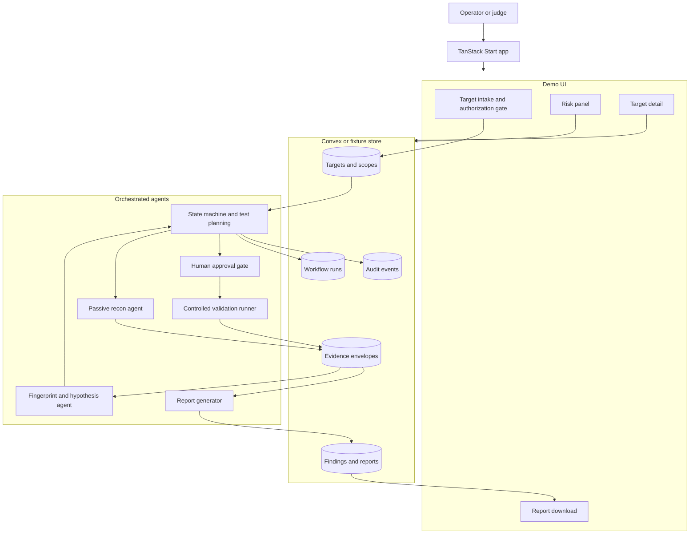
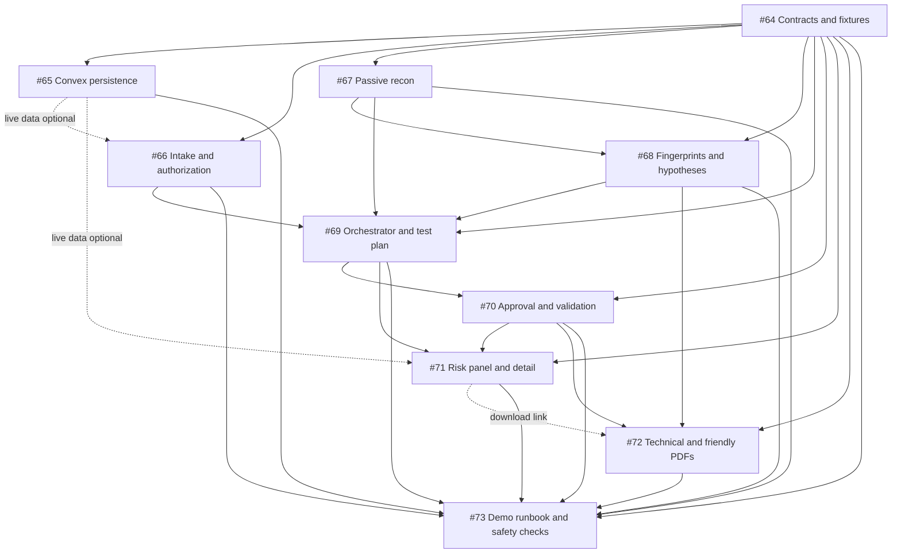
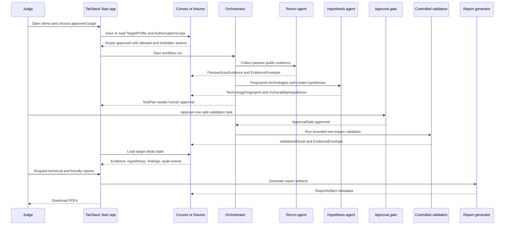

# OpenBreach

OpenBreach is the working title for the DEFF-ACC pivot: an authorized security-validation workflow for public-facing web systems. The product starts where passive scanners stop. It collects safe public evidence, turns that evidence into vulnerability hypotheses, asks a human to approve any low-impact validation, normalizes evidence, and generates remediation reports for technical and nontechnical audiences.

This README is the source of truth for the hackathon MVP plan. The new pivot issue inventory is GitHub issues [#64](https://github.com/jerif118/DEFF-ACC/issues/64) through [#73](https://github.com/jerif118/DEFF-ACC/issues/73). Earlier municipality-only issues are useful implementation context, but they are superseded by the pivot scope unless a teammate explicitly reuses their code.

## Idea Summary

Organizations operate public websites, APIs, portals, and service endpoints with limited security capacity. Attackers often find basic exposure first: expired TLS, missing browser security headers, exposed admin paths, public CMS fingerprints, and outdated technology hints.

OpenBreach helps a security operator or system owner see that exposure safely. It does not exploit, authenticate, brute force, fuzz forms, or scan private systems. It demonstrates a defensible path from approved target scope to passive recon, hypotheses, approval-gated validation, evidence, risk status, and remediation PDFs.

## MVP Definition

Target users:

- Security analysts or coordinators responsible for multiple public-facing systems.
- Small organization or public-sector technical owners who need prioritized remediation.
- Hackathon judges evaluating a credible defensive security workflow.

Core problem:

- Traditional pentesting is expensive, slow, and too aggressive for many small teams.
- Passive scanners are safer, but they usually stop at observations instead of producing a scoped, evidence-backed remediation workflow.
- Teams need a workflow that is useful without becoming an unauthorized exploitation tool.

Demo scenario:

- A judge opens the app, selects or enters an approved demo target, reviews the authorization scope, runs or loads passive recon evidence, sees fingerprints and hypotheses, approves one safe validation against an owned/fixture target, opens the target detail page, and downloads technical plus friendly remediation PDFs.

Success outcome:

- In 3 to 5 minutes, the team can show an end-to-end vertical slice from target intake to report generation, with scope gates and safety controls visible at every step.

## MVP Scope

Must have:

- Generic target and scope contracts for public-facing systems, not only municipalities.
- Fixture-first demo data for one approved target, one rejected target, passive evidence, hypotheses, approval gate, validation result, findings, reports, and audit events.
- Convex-backed or fixture-backed workflow storage for targets, runs, evidence, approvals, findings, reports, and audit events.
- Intake and authorization gate that refuses ambiguous or out-of-scope targets before any scan.
- Passive recon agent for safe public evidence: HTTP status, redirects, selected headers, cookie metadata, TLS summary, visible HTML metadata, `robots.txt`, `sitemap.xml`, and fixed public admin/config path checks.
- Fingerprinting and hypothesis generation from deterministic rules and a small local knowledge base.
- Orchestrator state machine that creates an approval-ready test plan and blocks validation until approval.
- One controlled low-impact validation runner for an owned demo target or deterministic fixture.
- Risk panel and target detail page showing scope, state, evidence, hypotheses, validation status, findings, and report links.
- Technical and friendly remediation PDFs generated from structured evidence and findings.
- Demo runbook, safety checklist, and fixture fallback.

Should have if time allows:

- Convex live sync for the full demo path instead of fixture-only state.
- Clerk-protected operator/admin actions for approvals and report generation.
- AI-assisted wording through Mastra and TanStack AI, grounded only in structured findings.
- A small portfolio view for multiple demo targets.
- Hosted demo deployment.

Deferred until after the hackathon:

- Production proof-of-control, signed authorization documents, customer portal, revocation workflows, and multi-tenant isolation.
- Full CVE feed integration or exhaustive technology fingerprint corpus.
- Broad asset discovery, crawling, directory enumeration, fuzzing, credential testing, or exploit validation.
- Continuous monitoring, scheduled scans, ticketing, compliance exports, and remediation tracking.
- Certification or legal compliance claims.

## Safety Boundary

The product is authorized security validation, not automated intrusion.

Allowed for the MVP:

- L1 passive checks: fetch public pages, inspect headers, cookies, TLS certificate summary, redirects, and visible metadata.
- L2 semiactive checks: request a fixed allowlist of public paths and explicitly approved subdomain or redirect observations.
- L3-light only in controlled form: deterministic pattern correlation and one owned/fixture low-impact validation task.

Not allowed:

- Exploit payloads, credential tests, brute force, authentication attempts, form submission, fuzzing, file upload, destructive requests, stealth, persistence, or private-network scanning.
- Treating hypotheses as confirmed findings without evidence.
- Publishing raw secrets or sensitive personal data.

## Assumptions And Risks

Assumptions:

- Team size and duration were not provided; the plan assumes 3 to 5 people and a 24 to 48 hour hackathon window.
- The intended repository is `jerif118/DEFF-ACC` at `https://github.com/jerif118/DEFF-ACC`.
- GitHub issues are enabled and the pivot issues have been created.
- Existing TypeScript, TanStack Start, Convex, Clerk, Mastra, TanStack AI, scanner, risk, report, and fixture code can be reused where it accelerates the pivot.
- Fixture mode must work even if Convex, Clerk, live scanning, AI provider credentials, or hosting are unavailable.

Risks and mitigations:

| Risk | Mitigation |
| --- | --- |
| The product is misunderstood as an exploitation tool. | Lead with authorization, passive defaults, approval gates, rate limits, audit logs, and controlled validation only. |
| Hackathon scope becomes too broad. | Build one vertical slice for one approved target before expanding target count or validation catalog. |
| Live network behavior is slow, blocked, or legally sensitive. | Use deterministic fixtures and an owned demo target as the primary demo path. |
| Hypotheses are mistaken for confirmed vulnerabilities. | Use explicit statuses: hypothesis, likely, confirmed, false positive, skipped, unresolved, halted. |
| AI output overstates findings. | Generate findings deterministically; use AI only for wording grounded in structured inputs. |
| Convex or Clerk configuration blocks the demo. | Keep fixture-backed reads and local report generation working without credentials. |

## Tech Stack

| Layer | Choice | Rationale |
| --- | --- | --- |
| App framework | TanStack Start, React, TypeScript | Existing repository stack; keeps UI, server routes, contracts, and scripts in one TypeScript codebase. |
| Runtime | Node.js `24.15.0` | Current `package.json` engine pin. |
| Package manager | `pnpm@11.1.2` | Current repository package manager. |
| Backend and database | Convex | Existing backend choice with typed functions, generated API types, and real-time data sync. |
| Auth | Clerk with Convex auth | Existing scaffold for protected operator/admin workflows. Fixture mode must not require auth. |
| Agent/workflow layer | Mastra | Existing scaffold can host report and orchestrator workflow boundaries. Keep deterministic fallback. |
| AI provider boundary | TanStack AI | Existing dependency for provider-agnostic wording/report assistance. Findings must stay evidence-grounded. |
| Contracts | Zod and TypeScript | Runtime validation plus shared types for independent task execution. |
| Reports | Existing local PDF/report code plus template fallback | A deterministic report path protects the demo when model credentials or hosted runtime are unavailable. |
| Fixtures | JSON fixtures under `data/` | Keeps demo repeatable and safe without live services. |

## Architecture

Primary pattern: contract-first orchestrated modular monolith.

Tradeoff:

- This keeps the hackathon build fast because the app, scanner, orchestrator, reports, and backend share one TypeScript repository.
- It is less scalable than a distributed job system, but scalability is not the MVP risk.

Fallback pattern: fixture-first deterministic demo.

Tradeoff:

- This is less realistic than live Convex plus live scans, but it preserves a judge-ready vertical slice when credentials, network access, or deployment are blocked.



## Shared Contracts

Issue [#64](https://github.com/jerif118/DEFF-ACC/issues/64) owns the exact TypeScript and Zod definitions. Downstream tasks may use local stubs with these names until #64 lands.

| Contract | Purpose |
| --- | --- |
| `TargetProfile` | Submitted organization, canonical URL, contact, and business context. |
| `AuthorizationScope` | Allowed assets, denied assets, time window, validation classes, rate limits, and forbidden actions. |
| `WorkflowRun` | Current state, target, timestamps, and run-level status. |
| `PassiveScanEvidence` | Browser-visible public evidence collected by the recon agent. |
| `TechnologyFingerprint` | Evidence-backed technology or platform inference with confidence. |
| `VulnerabilityHypothesis` | Security question mapped from public evidence, with severity estimate and validation class. |
| `TestPlan` | Approval-ready low-impact validation plan with expected evidence, limits, and stop conditions. |
| `ApprovalGate` | Pending, approved, denied, or expired human approval for a specific test plan. |
| `ValidationResult` | Confirmed, not confirmed, skipped, halted, false-positive, or error result from controlled validation. |
| `EvidenceEnvelope` | Normalized, minimized, redacted, and traceable evidence summary. |
| `Finding` | Reportable risk item with status, severity, confidence, evidence refs, limitations, and remediation refs. |
| `ReportArtifact` | Generated technical or friendly report metadata and file reference. |
| `AuditEvent` | Decision, skip, approval, denial, halt, redaction, and report-generation record. |

## Task Inventory

| ID | Title | Owner | Status | Dependencies | Link |
| --- | --- | --- | --- | --- | --- |
| #64 | Define target, scope, and evidence contracts | TBD | Open | None | https://github.com/jerif118/DEFF-ACC/issues/64 |
| #65 | Persist generic workflow runs in Convex | TBD | Open | #64 | https://github.com/jerif118/DEFF-ACC/issues/65 |
| #66 | Build target intake and authorization gate | TBD | Open | #64, optional #65 | https://github.com/jerif118/DEFF-ACC/issues/66 |
| #67 | Adapt passive recon agent for generic targets | TBD | Open | #64 | https://github.com/jerif118/DEFF-ACC/issues/67 |
| #68 | Generate fingerprints and vulnerability hypotheses | TBD | Open | #64, #67 or fixture evidence | https://github.com/jerif118/DEFF-ACC/issues/68 |
| #69 | Implement orchestrator state machine and test planning | TBD | Open | #64, #66, #67, #68 or fixtures | https://github.com/jerif118/DEFF-ACC/issues/69 |
| #70 | Add approval gate and controlled validation runner | TBD | Open | #64, #69 or fixture test plan | https://github.com/jerif118/DEFF-ACC/issues/70 |
| #71 | Build risk panel and target detail experience | TBD | Open | #64, optional #65, #69, #70 | https://github.com/jerif118/DEFF-ACC/issues/71 |
| #72 | Generate technical and friendly remediation PDFs | TBD | Open | #64, #68, #70, optional #71 | https://github.com/jerif118/DEFF-ACC/issues/72 |
| #73 | Add demo runbook, safety checks, and fixture fallback | TBD | Open | #64 through #72 | https://github.com/jerif118/DEFF-ACC/issues/73 |



Parallelization guidance:

- Start #64 first because it defines contracts and fixtures.
- #65, #66, and #67 can begin as soon as #64 has draft stubs.
- #68 can work from fixture evidence before #67 is complete.
- #69 can work from fixture scope/evidence/hypotheses before live agents are wired.
- #70 can work from a fixture `TestPlan` and `ApprovalGate` before #69 is complete.
- #71 and #72 should be fixture-first so the demo UI and report path do not block on backend integration.
- #73 should be updated continuously, but final verification waits for the vertical slice.

## Main Product Flow



## Runtime

- Node.js: `24.15.0`
- pnpm: `11.1.2`

## Local Setup

Prerequisites:

- Node.js `24.15.0`, matching `package.json`.
- pnpm `11.1.2`, matching `package.json`.
- Optional Convex deployment for live backend sync.
- Optional Clerk application keys for protected approval/operator flows.
- Optional model-provider key for AI-assisted report wording.

Install and run the app:

```bash
pnpm install
pnpm dev
```

Useful current commands:

```bash
pnpm typecheck
pnpm build
pnpm fixtures:validate
pnpm scanner:validate
pnpm scanner:fixture
pnpm risk:fixture
pnpm report:generate
pnpm report:generate:validate
```

Convex commands when a deployment is configured:

```bash
pnpm convex:dev
pnpm convex:codegen
```

Convex seed and persistence commands (require a configured deployment and, for
the persistence ones, a seeded `municipalities` table):

```bash
pnpm municipalities:seed       # internal mutation, runnable from CLI
pnpm scanner:persist           # live passive scan -> rawScanResults
pnpm risk:persist              # enriched results -> scanResults (feeds the UI)
```

Both `*:persist` scripts pipe their JSON payload into
`scripts/persist-via-convex.ts`, which chunks it and invokes `convex run` per
batch. This is required because Linux caps a single argv element at
`MAX_ARG_STRLEN` (128 KB), well below the size of a full enriched-scan payload;
the old `convex run … "$(...)"` form failed with `Argument list too long`.
Override the batch size with `PERSIST_BATCH_SIZE` (default `10`).

`pnpm scanner:persist` defaults to a live scan with concurrency=5 and visible
per-municipality progress on stderr. Useful env overrides understood by
`scripts/scan-convex-args.ts`:

```bash
SCAN_FROM_FIXTURE=1 pnpm scanner:persist                # reuse data/scans/latest.scan-results.json
SCAN_FIXTURE_PATH=path/to/file.json pnpm scanner:persist
MUNICIPALITY_IDS=mx-aguascalientes-aguascalientes,mx-bcn-tijuana pnpm scanner:persist
SCAN_TIMEOUT_MS=4000 SCAN_RETRIES=0 SCAN_CONCURRENCY=8 pnpm scanner:persist
PERSIST_BATCH_SIZE=5 pnpm scanner:persist               # smaller convex-run batches
```

Do not edit generated files under `convex/_generated/` by hand. Run `pnpm convex:codegen` or `pnpm convex:dev` when Convex API files need to refresh.

## Environment

Copy `.env.example` for local setup. The current repository recognizes these variables for live services:

| Variable | Required | Purpose |
| --- | --- | --- |
| `VITE_CONVEX_URL` | Yes for live Convex | Convex URL used by the client. |
| `CONVEX_DEPLOYMENT` | Yes for Convex tooling | Convex deployment identifier. |
| `VITE_CLERK_PUBLISHABLE_KEY` | Yes for auth UI | Clerk publishable key. |
| `CLERK_SECRET_KEY` | Yes for protected server routes | Clerk server-side secret. |
| `CLERK_JWT_ISSUER_DOMAIN` | Yes for Convex auth | Issuer configured in `convex/auth.config.ts`. |
| `REPORT_AI_ENABLED` | No | Enable AI-assisted report wording. Default should stay deterministic. |
| `AI_PROVIDER` | No | AI provider selected through TanStack AI. |
| `AI_PROVIDER_MODEL` | No | Model identifier for report wording. |
| `AI_PROVIDER_KEY` | No | Generic server-side provider key. |
| `OPENROUTER_API_KEY` | No | OpenRouter key when used. |
| `ANTHROPIC_API_KEY` | No | Anthropic key when used. |
| `GOOGLE_GENERATIVE_AI_API_KEY` | No | Gemini key when used. |
| `SCAN_CONCURRENCY` | No | Passive scan concurrency limit. Default `5` in `scripts/scan-convex-args.ts`. |
| `SCAN_TIMEOUT_MS` | No | Passive check timeout. Default `5000` ms. |
| `SCAN_RETRIES` | No | Per-request retry budget for the passive scanner. Default `1`. |
| `SCAN_DELAY_MS` | No | Delay between scan retries. Default `250` ms. |
| `SCAN_FROM_FIXTURE` | No | When set to `1`, `pnpm scanner:persist` reads `data/scans/latest.scan-results.json` instead of hitting the network. |
| `SCAN_FIXTURE_PATH` | No | Overrides the fixture file path used when `SCAN_FROM_FIXTURE=1`. |
| `MUNICIPALITY_IDS` | No | Comma-separated `municipality.id` allowlist consumed by `pnpm scanner:persist` to scope live or fixture-backed runs. |
| `PERSIST_BATCH_SIZE` | No | Number of `results` items forwarded per `convex run` invocation by `scripts/persist-via-convex.ts`. Default `10`; lower this if Convex rejects an oversized argument. |

## Development Workflow

- Pick one pivot issue from #64 through #73 and assign an owner.
- Use issue-local fixtures or stubs when an upstream task is not merged yet.
- Keep every output contract-compatible so tasks can integrate later without rework.
- Keep all scanner and validation behavior safe by default and bounded by scope.
- Prefer visible vertical-slice progress over production hardening.
- Add or update verification commands in the issue body and README only when scripts actually exist.
- Preserve fixture fallback for every live service integration.

## Demo Script

1. Open with the problem: many organizations expose public systems faster than small teams can assess and remediate them.
2. Show the safety model: target scope, allowed assets, denied assets, forbidden actions, rate limits, and passive default.
3. Run or load passive recon: show public HTTP/TLS/header/CMS/path evidence.
4. Show hypotheses: explain that these are evidence-backed questions, not confirmed compromise.
5. Approve one safe validation task: show human approval and stop conditions.
6. Show validation result: confirm, reject, skip, or halt with an evidence envelope and audit event.
7. Open the target detail page: show workflow timeline, evidence, hypotheses, findings, uncertainty, and remediation.
8. Download reports: show the technical PDF and friendly PDF.
9. Close with the boundary: no exploitation, no credentials, no payloads, fixture/owned target demo first.

Fallback demo path:

- Use committed fixtures instead of live scans.
- Use local deterministic reports instead of AI-assisted wording.
- Use fixture-backed UI if Convex credentials are unavailable.
- Use unsigned or mock approval state if Clerk is unavailable.
- Run locally if deployment is unavailable.

## Judging Narrative

What makes the MVP credible:

- It turns passive security signals into a scoped remediation workflow rather than just a score.
- It demonstrates human-in-the-loop authorization before any validation.
- It separates hypotheses, confirmed findings, skipped checks, and limitations.
- It gives both engineers and nontechnical owners an actionable report.
- It shows a path from one controlled target to a reusable multi-agent security-validation platform.

## Source Documents

- Pivot plan: [`pentesting-automation.md`](./pentesting-automation.md)
- Original product description: [`product-description.md`](./product-description.md)
- Original idea: [`IDEA.md`](./IDEA.md)
- DOCX concept note: [KID MYTHOS concept DOCX](./kid-mythos.docx)
- GitHub pivot issue inventory: https://github.com/jerif118/DEFF-ACC/issues?q=is%3Aissue%20%5BPivot%20MVP%5D
