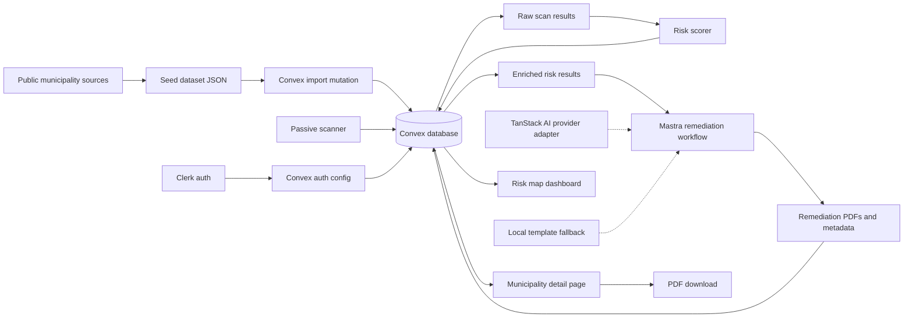
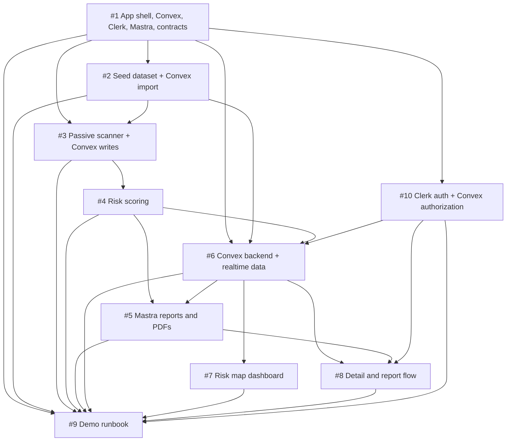
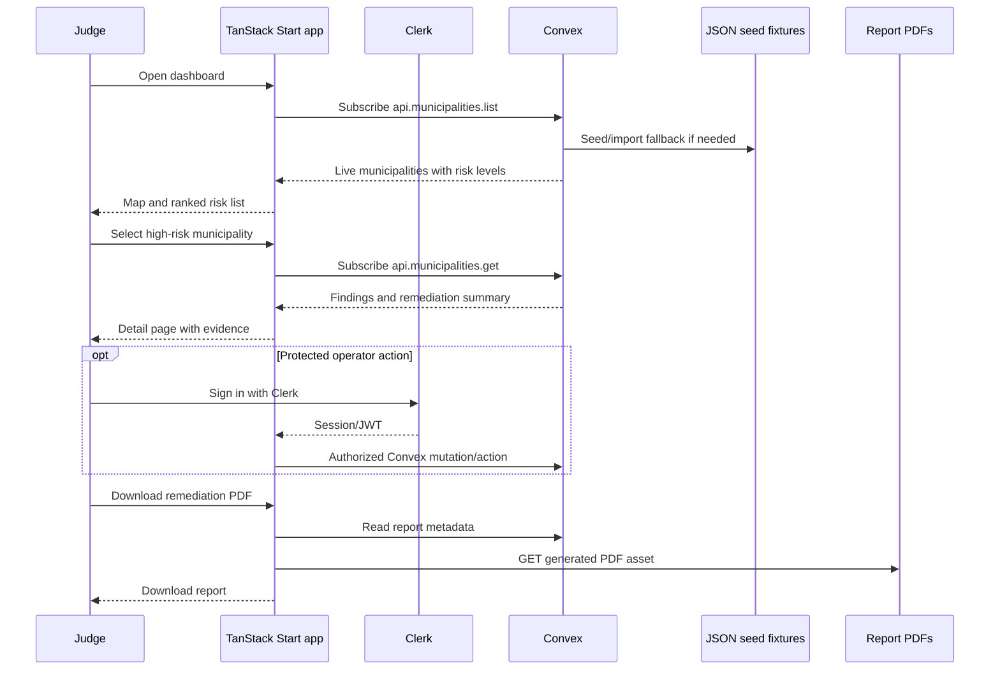

# DEFF-ACC: Passive Municipal Cyber Risk Map

DEFF-ACC is a hackathon MVP for helping Latin American municipal governments understand visible cybersecurity risk before attackers do. The first vertical slice focuses on Mexico: collect public website signals for major municipalities, store and sync results through Convex, score risk, show the result on an interactive map, and generate remediation PDFs for the highest-risk sites.

The project must stay passive. It only uses information any browser or normal HTTP client can see, such as TLS status, response headers, CMS hints, public admin paths, and known vulnerability metadata. It does not exploit, brute force, authenticate, submit forms, or scan private systems.

## Current Repository State

The repository now contains a TanStack Start starter scaffold and initial Convex generated client files, but it is not yet a DEFF-ACC product implementation.

Already present:

- `package.json`, `pnpm-lock.yaml`, `vite.config.ts`, `tsconfig.json`, and `src/` from a TanStack Start starter app.
- Generated Convex client files under `convex/_generated/` plus Convex AI guidance under `convex/_generated/ai/`.
- Local toolchain pins in `package.json`: Node.js `24.15.0` and `pnpm@11.1.2`.
- Basic scripts for local development, production build, typecheck, preview, Convex dev, and repository cleanup.

Still pending:

- Replacing starter routes, metadata, navigation, and sample API/demo content with DEFF-ACC product screens.
- Adding shared DEFF-ACC contracts in code.
- Adding `convex/schema.ts`, Convex queries/mutations/actions, and `convex/auth.config.ts` for Clerk-issued auth.
- Adding Clerk provider wiring and signed-in/signed-out UI states.
- Adding Mastra workflows, TanStack AI provider adapters, scanner/scoring/report modules, seed fixtures, and PDF generation.

Do not treat the current starter UI as implemented product scope. Issue `#1` now means completing and converting the existing scaffold, not creating a scaffold from nothing.

## MVP Definition

Target users: municipal IT technicians, regional cybersecurity responders, hackathon judges, and civic-tech partners who need a fast view of which public municipal sites need basic remediation.

Core problem: many municipal websites handle citizen services but lack dedicated cybersecurity staff. Known hygiene issues such as expired certificates, exposed CMS admin pages, old CMS versions, and risky headers are hard to prioritize across hundreds of sites.

Demo scenario: a judge opens the dashboard, sees Mexico municipalities colored by risk, clicks a critical municipality, reviews the observed public evidence, and downloads a concise remediation PDF with prioritized steps.

Success outcome: in 3-5 minutes, the team can show a defensible end-to-end flow from seed municipality data to passive scan findings, risk score, map visualization, detail page, and top-risk remediation report.

## Scope

Must have for the MVP:

- A TypeScript full-stack app shell with shared data contracts.
- Convex as the database and backend service layer, including schema, queries, mutations/actions, and real-time subscriptions.
- Clerk authentication and authorization for protected operator/admin workflows, integrated with Convex auth.
- A seed dataset of major Mexican municipalities, targeting 500 records but accepting at least 50 real records for the demo if time is tight.
- A passive scanner that captures reachability, TLS status, selected headers, CMS hints, and public admin path exposure.
- Deterministic scoring that turns passive signals into explainable findings and risk levels.
- A real-time dashboard with a Mexico risk map and highest-risk ranking backed by Convex live queries.
- A municipality detail page with findings, evidence, remediation text, and report download.
- Remediation report JSON and PDFs for the top 10 risky municipalities, generated through a Mastra workflow with a local template fallback if model credentials or runtime support are unavailable.
- A demo runbook with local commands, fallback fixture flow, safety notes, and judging script.

Should have if time allows:

- Full 500-municipality seed coverage.
- State and risk filters on the dashboard.
- Real-time scan progress and report-generation status indicators.
- Mastra-backed report generation using TanStack AI provider adapters.
- Hosted public demo deployment.
- Clerk organization roles or metadata-backed analyst/admin role management.
- Basic unit tests for contract validation and scoring thresholds.

Deferred until after the hackathon:

- Exploit validation, credential testing, brute force checks, or form submissions.
- Authenticated municipal portals or private network scanning.
- Continuous monitoring, scheduled scans, alerting, and long-term history.
- Production-grade RBAC policy design, audit logs, ticketing, and email delivery beyond the basic Clerk/Convex authorization needed for the MVP.
- Full CVE database mirroring or exhaustive CMS fingerprinting.
- Legal/compliance certification language.

## Assumptions And Risks

Assumptions:

- Team size and hackathon duration were not provided, so the plan assumes a 3-5 person team and a 24-48 hour build window.
- The repository is `jerif118/DEFF-ACC` at `https://github.com/jerif118/DEFF-ACC`.
- Issues are enabled and have been created as the source task inventory.
- The app uses TypeScript and currently pins Node.js `24.15.0` plus `pnpm@11.1.2` in `package.json`. This satisfies the current known package floors, including `@mastra/core` requiring Node.js `>=22.13.0`, `@tanstack/react-start` requiring Node.js `>=22.12.0`, and `@tanstack/ai` requiring Node.js `>=18`.
- Convex is the default database and backend service provider for live MVP data; JSON fixtures remain only for import/export, local fallback, and deterministic demos.
- Clerk is the default authentication and authorization provider; Convex should validate Clerk-issued auth for protected backend functions.
- The selected hosting provider needs explicit runtime configuration during implementation, so report generation must also work as an offline/local fixture pipeline if deployment setup is blocked.
- The first implementation should be Convex-backed, with fixtures available for seeding and deterministic fallback.

Risks and mitigations:

- Public source quality may be uneven. Mitigation: store source URLs per municipality and accept a smaller verified seed dataset for the demo.
- Passive CMS detection can produce false positives. Mitigation: display confidence and evidence, and avoid claiming confirmed compromise.
- Live scanning may be slow or blocked. Mitigation: commit generated fixture data and demo from fixtures when needed.
- Convex or Clerk setup can be blocked by missing project keys or auth configuration. Mitigation: keep seed/import scripts, local fixtures, and read-only public demo paths working while protected mutations are disabled.
- Model credentials or hosted runtime configuration may be unavailable. Mitigation: isolate AI generation behind a Mastra/TanStack AI adapter and keep a deterministic report template fallback.
- Map implementation can consume too much time. Mitigation: use markers or a static basemap first; defer municipality polygons.

## Tech Stack

Recommended stack:

| Layer                            | Choice                                           | Rationale                                                                                                                                                                                                                            |
| -------------------------------- | ------------------------------------------------ | ------------------------------------------------------------------------------------------------------------------------------------------------------------------------------------------------------------------------------------ |
| Full-stack web app               | TanStack Start with React and TypeScript         | The current docs describe TanStack Start as a full-stack React framework with SSR, streaming, API/server routes, server functions, Vite bundling, and universal deployment. This keeps the hackathon app in one TypeScript codebase. |
| Runtime                          | Node.js `24.15.0` project pin                     | Current project metadata pins Node.js `24.15.0`, which satisfies current known package floors for TanStack Start, Mastra, Convex, Clerk, and TanStack AI. Configure the selected host explicitly and keep local report generation plus committed artifacts as the fallback path. |
| Package manager                  | `pnpm@11.1.2`                                     | The repository currently declares pnpm in `package.json`; use pnpm commands in setup and runbooks unless the project intentionally changes package managers.                                             |
| Database and backend             | Convex                                           | Convex provides a reactive database, TypeScript backend functions, generated API types, and real-time subscriptions so the map/detail UI can update without custom polling.                                                          |
| Authentication and authorization | Clerk                                            | Clerk provides sign-in/session management and integrates with Convex through Clerk auth/JWT configuration for protected queries, mutations, and operator/admin workflows.                                                            |
| Fixture fallback                 | JSON fixtures in `data/`                         | Fixtures remain useful for seed import/export, deterministic demos, and offline fallback when live scanning, Convex, or model-backed reports are unavailable.                                                                        |
| Scanner and scoring              | TypeScript scripts/modules                       | Shares contracts with the web app and avoids cross-language glue. Python can be added later only if a specific scanner library justifies it.                                                                                         |
| Agent/workflow harness           | Mastra                                           | Mastra is a TypeScript framework for AI applications and agents, supports agents/tools/workflows, integrates with React/Node apps, and can also run standalone. This avoids AWS-specific runtime lock-in.                            |
| AI SDK                           | TanStack AI                                      | Provider-agnostic adapters, streaming/generation primitives, type-safe tools, observability events, and TanStack Start integration. Use it instead of Vercel AI SDK.                                                                 |
| Report generation                | Mastra workflow plus local template fallback     | The Mastra workflow owns report orchestration; TanStack AI owns provider calls; local templates protect the demo when model credentials or hosted runtime configuration are missing.                                                 |
| PDF rendering                    | Simple HTML-to-PDF or PDF library selected in #5 | Any solution is acceptable if PDFs are generated from the report contract and can be downloaded from the app.                                                                                                                        |
| Map UI                           | Fast marker-based map or static SVG fallback     | Markers with risk colors are enough for the demo; full municipal polygons are deferred.                                                                                                                                              |

Documentation note: Context7 was used to verify Convex and Clerk planning facts. Earlier TanStack/Mastra framework docs were verified with fallback sources because Context7 was unavailable at that time. The plan uses the linked TanStack Start docs, Mastra README/docs, TanStack AI README/docs, Convex docs, Clerk docs, and the TanStack Start + Mastra example repository as references.

## Architecture

Primary pattern: Convex-backed real-time pipeline inside one deployable full-stack TypeScript app.

This pattern optimizes for visible progress, real-time UX, and hosting portability. Convex stores municipalities, scan outputs, findings, scores, report metadata, and user/operator state. TanStack Start components subscribe to Convex queries directly or through TanStack Query integration where useful. Clerk wraps the app, and Convex is configured to trust Clerk-issued auth for protected backend functions. Mastra agents/tools/workflows live under `src/mastra`, and TanStack Start routes, Convex actions, or scripts invoke them through a narrow TypeScript boundary. TanStack AI handles provider-agnostic model calls. Each task can still build against fixtures before upstream work is finished.

Reference pattern: follow the separation shown in `ataschz/tanstack-start-mastra-example`: TanStack Start owns routes and UI, Mastra owns agents/tools/workflows, and a web boundary connects the UI to the agent runtime. This project should adapt the pattern without copying its Vercel AI SDK dependency; use TanStack AI instead.

Fallback pattern: fixture-seeded demo shell.

If live scanning, Convex deployment, Clerk configuration, model credentials, runtime support, or backend routes are blocked, the frontend can load committed mock JSON and static PDFs or seed Convex from committed fixtures. This weakens realism but preserves the judging walkthrough.



## Shared Contracts

All tasks should converge on these contracts, finalized in [#1](https://github.com/jerif118/DEFF-ACC/issues/1). Downstream tasks can use this shape as a local stub until #1 lands.

```ts
export type RiskLevel = "low" | "medium" | "high" | "critical";

export type Municipality = {
  id: string;
  name: string;
  state: string;
  population: number;
  websiteUrl: string;
  latitude: number;
  longitude: number;
  sourceUrl: string;
};

export type ScanFinding = {
  id: string;
  category:
    | "tls"
    | "headers"
    | "cms"
    | "admin-exposure"
    | "known-vulnerability"
    | "availability";
  severity: RiskLevel;
  title: string;
  evidence: string;
  remediation: string;
  sourceUrl?: string;
};

export type ScanResult = {
  municipalityId: string;
  scannedAt: string;
  url: string;
  reachable: boolean;
  httpStatus?: number;
  tls: { valid: boolean; expiresAt?: string; issuer?: string };
  headers: { server?: string; poweredBy?: string };
  cms?: {
    name: "wordpress" | "joomla" | "drupal" | "unknown";
    version?: string;
    confidence: number;
  };
  adminExposure: {
    wordpressLogin: boolean;
    joomlaAdmin: boolean;
    genericAdmin: boolean;
  };
  findings: ScanFinding[];
  riskScore: number;
  riskLevel: RiskLevel;
};

export type RemediationReport = {
  municipalityId: string;
  generatedAt: string;
  summary: string;
  prioritizedActions: Array<{ title: string; why: string; steps: string[] }>;
  pdfPath?: string;
};

export type AppRole = "viewer" | "analyst" | "admin";

export type UserProfile = {
  clerkUserId: string;
  role: AppRole;
  displayName?: string;
};
```

Expected Convex/data contract from [#6](https://github.com/jerif118/DEFF-ACC/issues/6):

```ts
api.municipalities.list -> Array<Municipality & { riskScore: number; riskLevel: RiskLevel }>
api.municipalities.get({ id }) -> { municipality: Municipality; scan?: ScanResult; report?: RemediationReport }
api.reports.getForMunicipality({ municipalityId }) -> RemediationReport | null
GET /api/reports/:municipalityId.pdf -> application/pdf | 404 // optional TanStack Start route for PDF assets
```

## Task Inventory

| ID  | Title                                                                    | Owner | Status | Dependencies                     | Link                                           |
| --- | ------------------------------------------------------------------------ | ----- | ------ | -------------------------------- | ---------------------------------------------- |
| #1  | Complete app shell, Convex, Clerk, Mastra runtime, and shared contracts  | TBD   | Open   | None                             | https://github.com/jerif118/DEFF-ACC/issues/1  |
| #2  | Curate top-municipality seed dataset and Convex import                   | TBD   | Open   | #1                               | https://github.com/jerif118/DEFF-ACC/issues/2  |
| #3  | Implement passive website scanner with Convex writes                     | TBD   | Open   | #1, #2                           | https://github.com/jerif118/DEFF-ACC/issues/3  |
| #4  | Add Convex-backed vulnerability matching and risk scoring                | TBD   | Open   | #3                               | https://github.com/jerif118/DEFF-ACC/issues/4  |
| #5  | Generate remediation reports with Mastra                                 | TBD   | Open   | #4, #6                           | https://github.com/jerif118/DEFF-ACC/issues/5  |
| #6  | Implement Convex backend and real-time data layer                        | TBD   | Open   | #1, #2, #4, #10                  | https://github.com/jerif118/DEFF-ACC/issues/6  |
| #7  | Build real-time Convex risk map dashboard                                | TBD   | Open   | #6, mock Convex data allowed     | https://github.com/jerif118/DEFF-ACC/issues/7  |
| #8  | Build Convex-backed municipality detail and report flow                  | TBD   | Open   | #5, #6, #10, mock detail allowed | https://github.com/jerif118/DEFF-ACC/issues/8  |
| #9  | Add Convex/Clerk demo runbook and deploy smoke test                      | TBD   | Open   | #1-#8, #10                       | https://github.com/jerif118/DEFF-ACC/issues/9  |
| #10 | Add Clerk auth and Convex authorization rules                            | TBD   | Open   | #1                               | https://github.com/jerif118/DEFF-ACC/issues/10 |



Parallelization guidance:

- #1 should start first because it defines the shared contracts and wires TanStack Start, Convex, Clerk, Mastra, and TanStack AI boundaries.
- #10 should start immediately after #1 so Convex authorization and protected operator/admin paths do not become an afterthought.
- #2, #3, #4, #5, #7, and #8 can start from the contract snippets and mock fixtures in their issue bodies.
- #6 integrates fixture outputs behind stable Convex queries/mutations/actions once #1, #2, #4, and #10 have usable artifacts.
- #9 should be updated continuously, but final verification waits for the vertical slice.

## Main Product Flow



## Local Setup

An executable TanStack Start starter exists, but DEFF-ACC product routes, Convex schema/functions, Clerk auth, Mastra workflows, scanner/scoring/report code, and fixture data are not implemented yet. [#1](https://github.com/jerif118/DEFF-ACC/issues/1) converts the starter into the product app shell and shared runtime boundary.

Prerequisites:

- Node.js `24.15.0`, matching `package.json`
- pnpm `11.1.2`, matching `package.json`
- Convex project URL/deployment for live data sync
- Clerk application keys and Clerk/Convex JWT issuer configuration for protected workflows
- Optional model-provider API key for AI-backed reports

Current scaffold commands:

```bash
pnpm install
pnpm dev
pnpm build
```

Convex generated files are present, but product schema/functions are not. Once #6 adds real Convex functions, use:

```bash
pnpm convex:dev
```

Target data and demo commands:

```bash
pnpm run validate:data
pnpm run seed:convex
pnpm run scan:sample
pnpm run score
pnpm run reports
pnpm build
```

If the team runs Mastra as a separate local development server, document and wire an explicit paired command such as:

```bash
pnpm run dev:mastra
```

Suggested environment variables:

| Variable                       | Required                          | Purpose                                                                                               |
| ------------------------------ | --------------------------------- | ----------------------------------------------------------------------------------------------------- |
| `REPORT_AI_ENABLED`            | No                                | Set to `true` to use Mastra + TanStack AI report generation; default should use local templates.      |
| `VITE_CONVEX_URL`              | Yes for live backend              | Convex deployment URL used by the TanStack Start client.                                              |
| `CONVEX_DEPLOYMENT`            | Yes for Convex deploy/dev scripts | Convex deployment identifier used by Convex tooling.                                                  |
| `VITE_CLERK_PUBLISHABLE_KEY`   | Yes for auth UI                   | Clerk publishable key for client-side Clerk provider setup.                                           |
| `CLERK_SECRET_KEY`             | Yes for protected server routes   | Clerk secret key for server-side request authentication when needed.                                  |
| `CLERK_JWT_ISSUER_DOMAIN`      | Yes for Convex auth               | Clerk issuer/domain configured in `convex/auth.config.ts` so Convex can validate Clerk-issued auth.   |
| `AI_MODEL_PROVIDER`            | No                                | Provider selected for TanStack AI adapters, for example `openai`, `anthropic`, `gemini`, or `ollama`. |
| `OPENAI_API_KEY`               | No                                | Provider key if OpenAI is selected.                                                                   |
| `ANTHROPIC_API_KEY`            | No                                | Provider key if Anthropic is selected.                                                                |
| `GOOGLE_GENERATIVE_AI_API_KEY` | No                                | Provider key if Gemini is selected.                                                                   |
| `SCAN_CONCURRENCY`             | No                                | Limits simultaneous passive requests.                                                                 |
| `SCAN_TIMEOUT_MS`              | No                                | Per-request timeout for passive checks.                                                               |

## Development Workflow

- Pick one issue from the task inventory and assign an owner in GitHub.
- Use the shared contracts or the issue-local mock contract if #1 is not merged yet.
- Keep tasks Convex-first but fixture-friendly so UI and backend work can proceed in parallel and the demo can fall back to committed data.
- Add or update verification commands in the issue body and README when scripts become real.
- Keep Clerk-protected mutations/actions disabled or mocked until Convex auth is configured and verified.
- Never add active exploitation, credential testing, destructive checks, or hidden scans.
- Prefer visible demo progress over production hardening.

## Demo Script

1. Open with the problem: Latin American municipalities operate many citizen-service websites with limited cybersecurity staffing, and basic public signals can reveal urgent hygiene issues.
2. Show the dashboard: explain that markers represent passive checks across major Mexican municipalities and colors represent low, medium, high, or critical risk.
3. Use the ranked list: select one critical municipality and explain the score is based on observed evidence, not exploitation.
4. Open the detail page: show TLS/header/CMS/admin exposure findings, evidence, and recommended remediation.
5. Download the PDF: show a technician-friendly report with prioritized actions for the top-risk municipality.
6. Explain safety and limitations: passive public data only, possible false positives, no proof of breach, and next steps for verified municipal outreach.

Fallback demo path:

- Use committed fixtures instead of live scans.
- Seed Convex from committed fixtures or use the static mock data path if Convex credentials are unavailable.
- Run read-only demo screens without Clerk sign-in if protected operator/admin workflows are not configured.
- Use local template reports instead of model-backed Mastra generation.
- Run the app locally if deployment is not ready.

## Judging Narrative

What makes the MVP credible:

- It solves a real, regional public-sector cybersecurity triage problem.
- It produces an end-to-end vertical slice instead of a slide-only concept.
- It avoids harmful behavior by using passive public signals only.
- It outputs concrete remediation steps that non-specialist municipal technicians can act on.
- It has a clear expansion path from 50 demo records to 500 municipalities, then to other countries.

## Safety Boundaries

- Only request public pages and fixed public admin paths with safe HTTP methods.
- Do not submit forms, test passwords, fuzz parameters, upload files, or run exploit payloads.
- Rate-limit requests and keep timeouts short.
- Store evidence as public observations and avoid sensitive personal data.
- Phrase results as risk indicators and recommendations, not confirmed compromise.

## Source Documents

- Original idea: [`IDEA.md`](./IDEA.md)
- GitHub issue inventory: https://github.com/jerif118/DEFF-ACC/issues
- TanStack Start docs: https://tanstack.com/start/latest
- Mastra: https://github.com/mastra-ai/mastra
- TanStack AI: https://tanstack.com/ai/latest
- Convex: https://docs.convex.dev/
- Clerk: https://clerk.com/docs
- TanStack Start + Mastra reference: https://github.com/ataschz/tanstack-start-mastra-example
