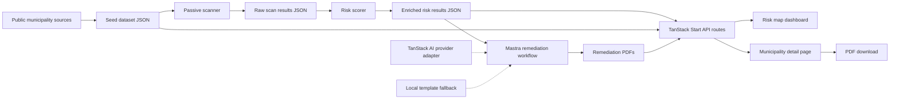
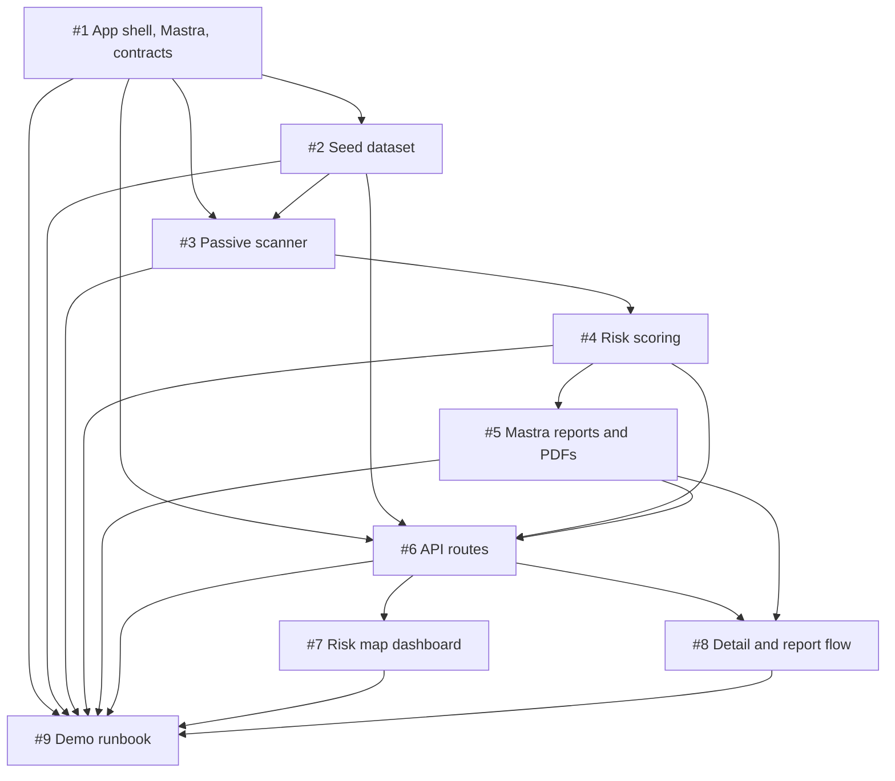
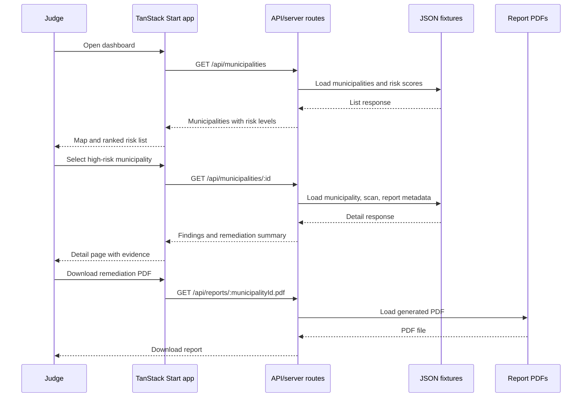

# DEFF-ACC: Passive Municipal Cyber Risk Map

DEFF-ACC is a hackathon MVP for helping Latin American municipal governments understand visible cybersecurity risk before attackers do. The first vertical slice focuses on Mexico: collect public website signals for major municipalities, score risk, show the result on an interactive map, and generate remediation PDFs for the highest-risk sites.

The project must stay passive. It only uses information any browser or normal HTTP client can see, such as TLS status, response headers, CMS hints, public admin paths, and known vulnerability metadata. It does not exploit, brute force, authenticate, submit forms, or scan private systems.

## MVP Definition

Target users: municipal IT technicians, regional cybersecurity responders, hackathon judges, and civic-tech partners who need a fast view of which public municipal sites need basic remediation.

Core problem: many municipal websites handle citizen services but lack dedicated cybersecurity staff. Known hygiene issues such as expired certificates, exposed CMS admin pages, old CMS versions, and risky headers are hard to prioritize across hundreds of sites.

Demo scenario: a judge opens the dashboard, sees Mexico municipalities colored by risk, clicks a critical municipality, reviews the observed public evidence, and downloads a concise remediation PDF with prioritized steps.

Success outcome: in 3-5 minutes, the team can show a defensible end-to-end flow from seed municipality data to passive scan findings, risk score, map visualization, detail page, and top-risk remediation report.

## Scope

Must have for the MVP:

- A TypeScript full-stack app shell with shared data contracts.
- A seed dataset of major Mexican municipalities, targeting 500 records but accepting at least 50 real records for the demo if time is tight.
- A passive scanner that captures reachability, TLS status, selected headers, CMS hints, and public admin path exposure.
- Deterministic scoring that turns passive signals into explainable findings and risk levels.
- A dashboard with a Mexico risk map and highest-risk ranking.
- A municipality detail page with findings, evidence, remediation text, and report download.
- Remediation report JSON and PDFs for the top 10 risky municipalities, generated through a Mastra workflow with a local template fallback if model credentials or runtime support are unavailable.
- A demo runbook with local commands, fallback fixture flow, safety notes, and judging script.

Should have if time allows:

- Full 500-municipality seed coverage.
- State and risk filters on the dashboard.
- Mastra-backed report generation using TanStack AI provider adapters.
- Hosted public demo deployment.
- Basic unit tests for contract validation and scoring thresholds.

Deferred until after the hackathon:

- Exploit validation, credential testing, brute force checks, or form submissions.
- Authenticated municipal portals or private network scanning.
- Continuous monitoring, scheduled scans, alerting, and history.
- Production database, user accounts, RBAC, ticketing, and email delivery.
- Full CVE database mirroring or exhaustive CMS fingerprinting.
- Legal/compliance certification language.

## Assumptions And Risks

Assumptions:

- Team size and hackathon duration were not provided, so the plan assumes a 3-5 person team and a 24-48 hour build window.
- The repository is `jerif118/DEFF-ACC` at `https://github.com/jerif118/DEFF-ACC`.
- Issues are enabled and have been created as the source task inventory.
- The app can use TypeScript and should target Node.js 24+ when TanStack AI is enabled, because the TanStack AI README currently documents Node.js v24+ as a requirement.
- The selected hosting provider may not support the required Node runtime immediately, so report generation must also work as an offline/local fixture pipeline.
- The first implementation can be fixture-backed instead of database-backed.

Risks and mitigations:

- Public source quality may be uneven. Mitigation: store source URLs per municipality and accept a smaller verified seed dataset for the demo.
- Passive CMS detection can produce false positives. Mitigation: display confidence and evidence, and avoid claiming confirmed compromise.
- Live scanning may be slow or blocked. Mitigation: commit generated fixture data and demo from fixtures when needed.
- Model credentials or hosted Node runtime support may be unavailable. Mitigation: isolate AI generation behind a Mastra/TanStack AI adapter and keep a deterministic report template fallback.
- Map implementation can consume too much time. Mitigation: use markers or a static basemap first; defer municipality polygons.

## Tech Stack

Recommended stack:

| Layer | Choice | Rationale |
| --- | --- | --- |
| Full-stack web app | TanStack Start with React and TypeScript | The current docs describe TanStack Start as a full-stack React framework with SSR, streaming, API/server routes, server functions, Vite bundling, and universal deployment. This keeps the hackathon app in one TypeScript codebase. |
| Runtime | Node.js 24+ for AI-enabled paths | TanStack AI currently documents Node.js v24+ as a requirement. If Vercel/Netlify runtime support is not available during the hackathon, generate reports locally and serve committed artifacts. |
| Data storage | JSON fixtures in `data/` | Fastest credible path for a hackathon; easy to inspect, commit, and demo offline. |
| Scanner and scoring | TypeScript scripts/modules | Shares contracts with the web app and avoids cross-language glue. Python can be added later only if a specific scanner library justifies it. |
| Agent/workflow harness | Mastra | Mastra is a TypeScript framework for AI applications and agents, supports agents/tools/workflows, integrates with React/Node apps, and can also run standalone. This avoids AWS-specific runtime lock-in. |
| AI SDK | TanStack AI | Provider-agnostic adapters, streaming/generation primitives, type-safe tools, observability events, and TanStack Start integration. Use it instead of Vercel AI SDK. |
| Report generation | Mastra workflow plus local template fallback | The Mastra workflow owns report orchestration; TanStack AI owns provider calls; local templates protect the demo when model credentials or runtime support are missing. |
| PDF rendering | Simple HTML-to-PDF or PDF library selected in #5 | Any solution is acceptable if PDFs are generated from the report contract and can be downloaded from the app. |
| Map UI | Fast marker-based map or static SVG fallback | Markers with risk colors are enough for the demo; full municipal polygons are deferred. |

Documentation note: Context7 was attempted for current framework docs but was unavailable because its API key is invalid in this environment. The plan uses the linked TanStack Start docs, Mastra README/docs, TanStack AI README/docs, and the TanStack Start + Mastra example repository as fallback references.

## Architecture

Primary pattern: fixture-first pipeline inside one deployable full-stack TypeScript app.

This pattern optimizes for visible progress and hosting portability. Data, scan outputs, scores, and reports are stored as JSON/PDF artifacts that the TanStack Start app serves through typed routes. Mastra agents/tools/workflows live under `src/mastra`, and TanStack Start routes or scripts invoke them through a narrow TypeScript boundary. TanStack AI handles provider-agnostic model calls. Each task can build against fixtures before upstream work is finished.

Reference pattern: follow the separation shown in `ataschz/tanstack-start-mastra-example`: TanStack Start owns routes and UI, Mastra owns agents/tools/workflows, and a web boundary connects the UI to the agent runtime. This project should adapt the pattern without copying its Vercel AI SDK dependency; use TanStack AI instead.

Fallback pattern: static demo shell.

If live scanning, model credentials, runtime support, or API routes are blocked, the frontend can load committed mock JSON and static PDFs. This weakens realism but preserves the judging walkthrough.



## Shared Contracts

All tasks should converge on these contracts, finalized in [#1](https://github.com/jerif118/DEFF-ACC/issues/1). Downstream tasks can use this shape as a local stub until #1 lands.

```ts
export type RiskLevel = 'low' | 'medium' | 'high' | 'critical'

export type Municipality = {
  id: string
  name: string
  state: string
  population: number
  websiteUrl: string
  latitude: number
  longitude: number
  sourceUrl: string
}

export type ScanFinding = {
  id: string
  category: 'tls' | 'headers' | 'cms' | 'admin-exposure' | 'known-vulnerability' | 'availability'
  severity: RiskLevel
  title: string
  evidence: string
  remediation: string
  sourceUrl?: string
}

export type ScanResult = {
  municipalityId: string
  scannedAt: string
  url: string
  reachable: boolean
  httpStatus?: number
  tls: { valid: boolean; expiresAt?: string; issuer?: string }
  headers: { server?: string; poweredBy?: string }
  cms?: { name: 'wordpress' | 'joomla' | 'drupal' | 'unknown'; version?: string; confidence: number }
  adminExposure: { wordpressLogin: boolean; joomlaAdmin: boolean; genericAdmin: boolean }
  findings: ScanFinding[]
  riskScore: number
  riskLevel: RiskLevel
}

export type RemediationReport = {
  municipalityId: string
  generatedAt: string
  summary: string
  prioritizedActions: Array<{ title: string; why: string; steps: string[] }>
  pdfPath?: string
}
```

Expected API contract from [#6](https://github.com/jerif118/DEFF-ACC/issues/6):

```ts
GET /api/municipalities -> Array<Municipality & { riskScore: number; riskLevel: RiskLevel }>
GET /api/municipalities/:id -> { municipality: Municipality; scan?: ScanResult; report?: RemediationReport }
GET /api/reports/:municipalityId.pdf -> application/pdf | 404
```

## Task Inventory

| ID | Title | Owner | Status | Dependencies | Link |
| --- | --- | --- | --- | --- | --- |
| #1 | Bootstrap app shell, Mastra runtime, and shared contracts | TBD | Open | None | https://github.com/jerif118/DEFF-ACC/issues/1 |
| #2 | Curate top-municipality seed dataset | TBD | Open | #1 | https://github.com/jerif118/DEFF-ACC/issues/2 |
| #3 | Implement passive website scanner | TBD | Open | #1, #2 | https://github.com/jerif118/DEFF-ACC/issues/3 |
| #4 | Add vulnerability matching and risk scoring | TBD | Open | #3 | https://github.com/jerif118/DEFF-ACC/issues/4 |
| #5 | Generate remediation summaries and PDFs | TBD | Open | #4 | https://github.com/jerif118/DEFF-ACC/issues/5 |
| #6 | Expose fixture-backed API routes | TBD | Open | #1, #2, #4, #5 | https://github.com/jerif118/DEFF-ACC/issues/6 |
| #7 | Build interactive risk map dashboard | TBD | Open | #6, mock API allowed | https://github.com/jerif118/DEFF-ACC/issues/7 |
| #8 | Build municipality detail and report flow | TBD | Open | #5, #6, mock detail allowed | https://github.com/jerif118/DEFF-ACC/issues/8 |
| #9 | Add demo runbook and deploy smoke test | TBD | Open | #1-#8 | https://github.com/jerif118/DEFF-ACC/issues/9 |



Parallelization guidance:

- #1 should start first because it defines the shared contracts.
- #2, #3, #4, #5, #7, and #8 can start from the contract snippets and mock fixtures in their issue bodies.
- #6 integrates fixture outputs behind stable routes once #1, #2, #4, and #5 have usable artifacts.
- #9 should be updated continuously, but final verification waits for the vertical slice.

## Main Product Flow



## Local Setup

The executable app does not exist yet; [#1](https://github.com/jerif118/DEFF-ACC/issues/1) creates it. These are the target commands the team should make real during implementation.

Prerequisites:

- Node.js 24+ for TanStack AI-enabled report generation
- npm
- Optional model-provider API key for AI-backed reports

Target setup:

```bash
npm install
npm run dev
```

Target data and demo commands:

```bash
npm run validate:data
npm run scan:sample
npm run score
npm run reports
npm run build
```

If the team runs Mastra as a separate local development server, document and wire an explicit paired command such as:

```bash
npm run dev:mastra
```

Suggested environment variables:

| Variable | Required | Purpose |
| --- | --- | --- |
| `REPORT_AI_ENABLED` | No | Set to `true` to use Mastra + TanStack AI report generation; default should use local templates. |
| `AI_MODEL_PROVIDER` | No | Provider selected for TanStack AI adapters, for example `openai`, `anthropic`, `gemini`, or `ollama`. |
| `OPENAI_API_KEY` | No | Provider key if OpenAI is selected. |
| `ANTHROPIC_API_KEY` | No | Provider key if Anthropic is selected. |
| `GOOGLE_GENERATIVE_AI_API_KEY` | No | Provider key if Gemini is selected. |
| `SCAN_CONCURRENCY` | No | Limits simultaneous passive requests. |
| `SCAN_TIMEOUT_MS` | No | Per-request timeout for passive checks. |

## Development Workflow

- Pick one issue from the task inventory and assign an owner in GitHub.
- Use the shared contracts or the issue-local mock contract if #1 is not merged yet.
- Keep tasks fixture-friendly so UI and backend work can proceed in parallel.
- Add or update verification commands in the issue body and README when scripts become real.
- Never add active exploitation, credential testing, destructive checks, or hidden scans.
- Prefer visible demo progress over production hardening.

## Demo Script

1. Open with the problem: Latin American municipalities operate many citizen-service websites with limited cybersecurity staffing, and basic public signals can reveal urgent hygiene issues.
2. Show the dashboard: explain that markers represent passive checks across major Mexican municipalities and colors represent low, medium, high, or critical risk.
3. Use the ranked list: select one critical municipality and explain the score is based on observed evidence, not exploitation.
4. Open the detail page: show TLS/header/CMS/admin exposure findings, evidence, and recommended remediation.
5. Download the PDF: show a technician-friendly report with prioritized actions for the top-risk municipality.
6. Explain safety and limitations: passive public data only, possible false positives, no proof of breach, and next steps for verified municipal outreach.

Fallback demo path:

- Use committed fixtures instead of live scans.
- Use local template reports instead of model-backed Mastra generation.
- Run the app locally if deployment is not ready.

## Judging Narrative

What makes the MVP credible:

- It solves a real, regional public-sector cybersecurity triage problem.
- It produces an end-to-end vertical slice instead of a slide-only concept.
- It avoids harmful behavior by using passive public signals only.
- It outputs concrete remediation steps that non-specialist municipal technicians can act on.
- It has a clear expansion path from 50 demo records to 500 municipalities, then to other countries.

## Safety Boundaries

- Only request public pages and fixed public admin paths with safe HTTP methods.
- Do not submit forms, test passwords, fuzz parameters, upload files, or run exploit payloads.
- Rate-limit requests and keep timeouts short.
- Store evidence as public observations and avoid sensitive personal data.
- Phrase results as risk indicators and recommendations, not confirmed compromise.

## Source Documents

- Original idea: [`IDEA.md`](./IDEA.md)
- GitHub issue inventory: https://github.com/jerif118/DEFF-ACC/issues
- TanStack Start docs: https://tanstack.com/start/latest
- Mastra: https://github.com/mastra-ai/mastra
- TanStack AI: https://tanstack.com/ai/latest
- TanStack Start + Mastra reference: https://github.com/ataschz/tanstack-start-mastra-example
