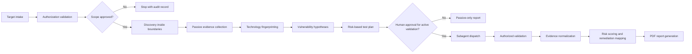
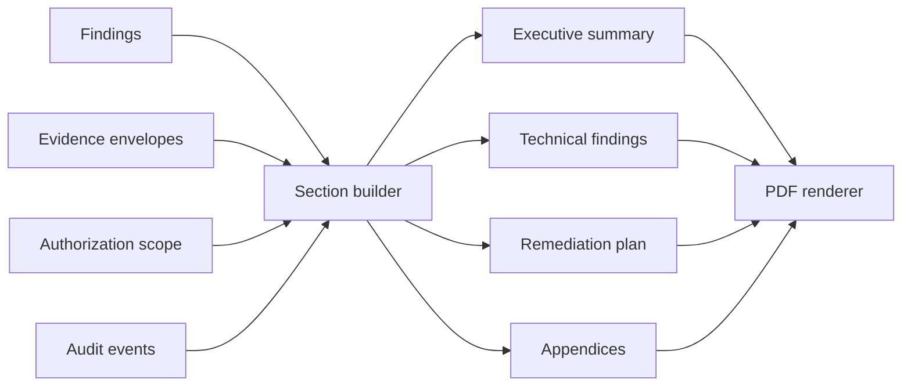

# Pentesting Automation Platform: Authorized Security Validation for Public-Facing Systems

The platform is a strategic pivot from passive public-risk scanning into an authorized security-validation workflow that helps organizations discover exposed web assets, form evidence-backed vulnerability hypotheses, safely validate approved risks, and generate board-ready and engineer-ready remediation reports without becoming an uncontrolled exploitation tool.

## Executive Summary

The original DEFF-ACC direction focused on passive cybersecurity visibility for municipal websites: collect public HTTP, TLS, CMS, and configuration signals, score visible risk, and generate remediation guidance. That remains a useful first layer, but it is no longer the product boundary. The stronger product is a generic platform for any public-facing website or web system: municipalities, companies, NGOs, universities, public institutions, healthcare networks, civic tech projects, and small teams that cannot afford continuous manual pentesting.

This document describes a future product line, not the current implementation state of the DEFF-ACC repository. The current repository should be understood as a passive scanning foundation. The pivot is to build an orchestrated, multi-agent security-validation system where active validation is available only after authorization, scope checks, rate controls, human approval, evidence normalization, and audit logging. The product promise is not "automated hacking." The promise is "defensible proof of risk for assets you are allowed to test."

## Why Passive Scanning Alone Is Insufficient

Passive scanners are valuable because they are safe, cheap, repeatable, and easy to explain. Tools such as [MDN HTTP Observatory](https://developer.mozilla.org/en-US/observatory) assess website security headers and other visible configuration signals. That category of tooling can identify missing HSTS, weak content-security posture, cookie issues, TLS-related signals, and other browser-facing hygiene problems.

The limitation is that passive scanning usually stops at observation. It can say "this site appears to be missing a control" or "this technology may be outdated," but it does not coordinate the next steps an organization needs:

- Determine which assets are actually in scope and who approved them.
- Expand discovery only inside explicit boundaries.
- Distinguish a weak signal from a validated finding.
- Convert version or configuration clues into testable vulnerability hypotheses.
- Decide which checks are safe, useful, and worth human approval.
- Collect evidence in a consistent way that can survive review.
- Record skipped tests, false positives, rate limits, denied approvals, and uncertainty.
- Produce remediation guidance in a form that engineers, executives, and auditors can act on.

The differentiation is orchestration. The platform should combine passive visibility with authorized validation, evidence integrity, risk scoring, remediation mapping, and PDF reporting. Passive scanning becomes the first stage of a larger decision system.

## Product Framing: Any Public-Facing System

The product is a security-validation platform for public-facing web systems. A "system" can be:

- A marketing website, web application, API gateway, CMS, customer portal, public dashboard, or documentation site.
- A municipal service portal, university site, NGO donation platform, company login page, or public institution service endpoint.
- A group of related domains, subdomains, APIs, and cloud-hosted frontends owned or approved by the same organization.

Municipalities remain an important customer segment because they often have high public-service impact and limited security staffing. They are one segment, not the core product boundary.

The platform serves four core users:

- Security engineers who need structured validation and evidence.
- Product and infrastructure teams who need prioritized remediation.
- Executives and program owners who need plain-language risk summaries.
- Hackathon judges, investors, and partners who need to see a credible path from demo to defensible product.

## Product-Line Maturity Levels

| Level | Product stage | What it does | Safety posture | Primary deliverable |
| --- | --- | --- | --- | --- |
| L0 | Asset intake | Accepts targets, owner metadata, and authorization documents. | No scanning. Validates form completeness and ownership signals. | Target profile and authorization scope. |
| L1 | Passive scanning | Fetches browser-visible HTTP, TLS, DNS, headers, robots, sitemap, CMS hints, and public metadata. | Safe methods, low rate, no payloads, no authentication. | Passive evidence and baseline risk score. |
| L2 | Enriched reconnaissance | Fingerprints technologies, correlates versions, maps public signals to CVE and CWE hypotheses. | Hypothesis-only. No confirmation through exploitation. | Vulnerability hypotheses with confidence and uncertainty. |
| L3 | Authorized validation | Runs approved low-impact checks against explicit in-scope assets. | Requires human approval, rate limits, stop conditions, audit logs. | Validation results and proof-of-risk evidence. |
| L4 | Orchestrated pentest automation | Coordinates subagents for planning, validation, evidence normalization, scoring, remediation, and reporting. | Safety gates at every transition; active work only on approved assets. | Full PDF report, audit trail, and remediation plan. |
| L5 | Continuous validation program | Repeats approved workflows, tracks fixes, re-tests, and integrates with tickets and compliance processes. | Change-aware, consent-aware, and revocable by scope owner. | Trend reports, fix verification, and operational metrics. |

## End-to-End Orchestration Workflow

The orchestrator is the decision-making layer. It does not merely call scanners. It controls target intake, scope validation, discovery, passive reconnaissance, fingerprinting, vulnerability hypothesis generation, test planning, human approvals, authorized validation, evidence normalization, risk scoring, remediation writing, report generation, and audit logging.



| Phase | Orchestrator responsibility | Inputs | Outputs | Gate or failure state |
| --- | --- | --- | --- | --- |
| 1. Target intake and authorization validation | Collect target, owner, contact, intended test depth, proof of authorization, and time window. | Requested URL, organization, approver identity, scope document. | `TargetProfile`, `AuthorizationScope`. | Stop if authorization is missing, expired, ambiguous, or conflicts with requested actions. |
| 2. System discovery and scope expansion | Discover related assets only when scope permits expansion rules. | Seed domains, allowed patterns, denylist, max depth. | `DiscoveryResult`. | Stop or skip assets outside approved boundaries. |
| 3. Passive scan and public-signal collection | Collect browser-visible signals using safe request methods and bounded rates. | Approved assets, passive scan policy. | `PassiveScanEvidence`. | Mark unreachable, blocked, timed out, or rate-limited assets without retry storms. |
| 4. Technology fingerprinting | Infer technologies with confidence scores and evidence references. | HTTP evidence, page metadata, headers, TLS, DNS, public files. | `TechnologyFingerprint`. | Do not infer exact versions when evidence is weak. |
| 5. Vulnerability and CVE hypothesis generation | Correlate fingerprints to CVE, CWE, vendor advisory, and misconfiguration patterns. | Fingerprints, passive evidence, vulnerability metadata. | `VulnerabilityHypothesis`. | Hypotheses are not findings until validated or accepted as passive risk. |
| 6. Risk-based test planning | Select low-impact validation checks based on authorization, confidence, severity, and business context. | Hypotheses, scope, safety policy. | `TestPlan`. | Skip tests that require forbidden actions or unclear consent. |
| 7. Human approval gate | Present test plan, expected impact, rate limits, evidence to collect, and stop conditions. | Test plan, scope, approver role. | `ApprovalGate`. | Active validation cannot start without explicit approval. |
| 8. Specialized subagent dispatch | Assign bounded tasks to subagents with deterministic inputs and allowed actions. | Approved test plan, subagent registry. | `SubagentTask` records. | Refuse tasks with missing contracts or unsafe action requests. |
| 9. Authorized proof-of-risk or proof-of-presence validation | Execute approved checks against approved assets during the approved window. | Subagent tasks, approval gate, rate policy. | `ValidationResult`. | Stop on unexpected auth prompt, sensitive data exposure, error spike, scope drift, or owner cancellation. |
| 10. Evidence normalization | Convert raw outputs into signed, deduplicated, redacted evidence envelopes. | Raw subagent outputs. | `EvidenceEnvelope`. | Quarantine evidence containing secrets or personal data until redaction. |
| 11. Risk scoring and remediation mapping | Score confirmed, likely, false-positive, skipped, and unresolved items separately. | Evidence, hypotheses, business criticality. | `Finding`. | Never upgrade a hypothesis to confirmed without sufficient evidence. |
| 12. PDF report generation | Generate executive, technical, and remediation sections with audit appendix. | Findings, evidence, scope, approvals, skipped tests. | `ReportSection`, PDF artifact. | Report must disclose scope, limitations, and validation status. |

## Main Orchestrator and Subagent Design

The orchestrator is a stateful workflow controller with a strict security model. It should be deterministic where correctness matters and AI-assisted where explanation, summarization, or remediation prose adds value.

### Core Orchestrator Responsibilities

- Validate that every target has an approved `AuthorizationScope` before any network activity.
- Maintain a canonical asset inventory and reject scope expansion outside explicit rules.
- Coordinate passive scanning, discovery, fingerprinting, CVE correlation, test planning, validation, evidence normalization, risk scoring, and reporting.
- Dispatch subagents through typed `SubagentTask` objects rather than free-form instructions.
- Enforce safety gates before active validation, including human approval, test window, rate limits, allowed methods, and stop conditions.
- Normalize subagent outputs into deterministic contracts with validation errors instead of accepting arbitrary text.
- Track every decision, skip, approval, denial, timeout, redaction, retry, and report generation event in an audit trail.
- Separate "hypothesis," "validated risk," "false positive," "skipped," and "unresolved" states.
- Prefer partial, accurate reporting over broad claims.

### Orchestrator State Machine

| State | Meaning | Allowed next states |
| --- | --- | --- |
| `INTAKE_PENDING` | Target was submitted but not validated. | `SCOPE_APPROVED`, `REJECTED` |
| `SCOPE_APPROVED` | Authorization and boundaries are clear. | `DISCOVERY_RUNNING`, `PASSIVE_RUNNING` |
| `DISCOVERY_RUNNING` | Approved discovery is underway. | `PASSIVE_RUNNING`, `HALTED` |
| `PASSIVE_RUNNING` | Public signals are being collected. | `FINGERPRINTING`, `HALTED` |
| `FINGERPRINTING` | Technology evidence is being normalized. | `HYPOTHESIS_GENERATION`, `HALTED` |
| `HYPOTHESIS_GENERATION` | CVE and misconfiguration hypotheses are created. | `TEST_PLANNING`, `PASSIVE_REPORT_READY` |
| `TEST_PLANNING` | The system proposes safe validation tasks. | `AWAITING_APPROVAL`, `PASSIVE_REPORT_READY` |
| `AWAITING_APPROVAL` | Human approval is required before active validation. | `VALIDATION_RUNNING`, `PASSIVE_REPORT_READY`, `REJECTED` |
| `VALIDATION_RUNNING` | Approved subagents are running bounded checks. | `EVIDENCE_NORMALIZATION`, `HALTED` |
| `EVIDENCE_NORMALIZATION` | Results are redacted, hashed, and deduplicated. | `SCORING`, `HALTED` |
| `SCORING` | Findings are classified and prioritized. | `REPORTING` |
| `REPORTING` | PDF and structured artifacts are generated. | `COMPLETE` |
| `HALTED` | Safety stop, owner stop, rate stop, or internal failure. | `REPORTING`, `COMPLETE` |

### Decision Rules

- No authorization, no scan.
- No active approval, no active validation.
- No deterministic contract, no subagent dispatch.
- No evidence reference, no confirmed finding.
- No clear scope boundary, no discovery expansion.
- No safe stop condition, no validation task.
- No redaction review, no report publication.

## Processing Pipeline for Discovery and Hypothesis Generation

The discovery and hypothesis layer should convert messy public signals into structured, reviewable security questions.

1. Normalize the target into canonical URL, hostname, organization, expected ownership, and contact metadata.
2. Apply authorization boundaries: allowed domains, subdomains, paths, IP ranges if applicable, time windows, rate limits, and forbidden areas.
3. Discover related assets only through approved rules: redirects, DNS records, certificate subject alternative names, sitemap references, explicitly allowed subdomain patterns, and customer-provided lists.
4. Collect passive signals: HTTP status, redirects, response headers, cookies, TLS certificate metadata, visible generator tags, public robots and sitemap entries, visible JavaScript package hints, and reachable public admin indicators.
5. Fingerprint technologies with evidence-backed confidence rather than single-source guesses.
6. Correlate fingerprints to vulnerability metadata at a hypothesis level:
   - Affected product or component.
   - Evidence supporting the product match.
   - Confidence in version or configuration match.
   - Relevant CVE, CWE, vendor advisory, or misconfiguration category.
   - Known exploitability metadata without storing exploit code, payloads, or bypass instructions.
   - Recommended validation class: passive-only, safe active check, manual review, or out of scope.
7. Convert hypotheses into a risk-based test plan that accounts for severity, confidence, business criticality, validation safety, and customer approval level.

The key rule is that vulnerability correlation creates questions, not conclusions. A hypothesis becomes a finding only after passive evidence is sufficient or an approved validation result confirms the condition.

## Specialized Subagent Registry

Each subagent is independently buildable because it receives typed inputs, operates under explicit allowed actions, returns typed outputs, and stops on deterministic conditions. The orchestrator owns sequencing and safety; subagents own narrow expertise.

| Subagent | Purpose | Inputs | Outputs | Allowed actions | Forbidden actions | Stop conditions | Validation checks | Parallel build notes |
| --- | --- | --- | --- | --- | --- | --- | --- | --- |
| Scope and Authorization Agent | Verify ownership signals, approved assets, test window, approver role, and allowed test depth. | `TargetProfile`, uploaded scope text, approver metadata. | `AuthorizationScope`, scope errors, denylist. | Parse scope docs, compare requested targets to approved patterns, request clarification flags. | Invent approval, broaden scope, override denied actions. | Missing owner, expired approval, conflicting scope, ambiguous wildcard. | All targets map to explicit allow rule; all forbidden actions are represented. | Can be built first as pure validation logic with fixtures. |
| Target Discovery Agent | Find related assets within approved boundaries. | `AuthorizationScope`, seed targets, discovery policy. | `DiscoveryResult`. | Bounded DNS lookups, redirect following, sitemap parsing, approved subdomain enumeration. | Deep crawling outside scope, port scanning outside approval, private-network probing. | Max depth, max assets, denylist match, scope mismatch, owner cancellation. | Every asset has a discovery source and scope rule reference. | Can run in parallel with passive scanner for seed targets. |
| Passive Recon Agent | Collect public web signals safely. | `DiscoveryResult`, passive scan policy. | `PassiveScanEvidence`. | Safe HTTP requests, TLS handshake metadata, header and cookie capture with redaction. | Authentication, form submission, request bodies, brute force, exploit probes. | Timeout, rate limit, HTTP block, sensitive data detection. | Methods are safe; no credentials; no bodies; evidence is timestamped. | Can be implemented with mocked HTTP/TLS adapters. |
| Technology Fingerprinting Agent | Infer CMS, frameworks, servers, CDNs, and libraries. | `PassiveScanEvidence`. | `TechnologyFingerprint`. | Match headers, HTML metadata, script names, public fingerprints, version hints. | Claim exact versions without evidence, execute client scripts, fetch unapproved paths. | Confidence below threshold, conflicting signals, insufficient evidence. | Every fingerprint references evidence IDs and confidence. | Can be built as deterministic rules plus optional model explanation. |
| CVE and Exploit Correlation Agent | Generate vulnerability hypotheses from fingerprints and public metadata. | `TechnologyFingerprint`, evidence refs, vulnerability knowledge base. | `VulnerabilityHypothesis`. | Map products to CVE/CWE/advisory records, classify exploit maturity at metadata level. | Store exploit payloads, generate bypass steps, confirm compromise. | Product mismatch, version uncertainty, unsupported component. | Hypotheses include confidence and validation class. | Can be built as a local knowledge-base matcher before external feeds. |
| Test Planning Agent | Convert hypotheses into an approval-ready validation plan. | `VulnerabilityHypothesis`, `AuthorizationScope`, safety policy. | `TestPlan`. | Rank tests by risk, impact, confidence, and safety; propose passive-only alternatives. | Schedule forbidden checks, hide impact, auto-approve active work. | No approved validation class, excessive risk, missing stop condition. | Each test has expected evidence, max rate, rollback, and stop rules. | Can be built as pure planning over mocked hypotheses. |
| Web Misconfiguration Validation Agent | Validate approved web configuration issues. | Approved `SubagentTask`, passive evidence, approval gate. | `ValidationResult`. | Low-impact checks for approved headers, redirects, cookie attributes, public config exposure. | Payload injection, destructive requests, auth bypass, fuzzing beyond approval. | Unexpected state change, error spike, sensitive content, rate limit. | Results map to a hypothesis and include evidence envelope refs. | Can be built independently with a local test server. |
| CMS Validation Agent | Validate approved CMS exposure and outdated-component risks. | Approved `SubagentTask`, CMS fingerprints, scope. | `ValidationResult`. | Check approved public CMS metadata, known public endpoints, non-invasive version confirmation. | Login attempts, plugin exploitation, credential guessing, write actions. | Login wall, sensitive data, version ambiguity, forbidden path. | Version confidence and source trail are explicit. | Can be built with WordPress, Drupal, or mock CMS fixtures. |
| TLS and Header Validation Agent | Validate transport and browser security posture. | Approved target URLs, passive evidence. | `ValidationResult`. | TLS metadata checks, certificate chain checks, redirect checks, header validation. | Downgrade attempts, interception, cipher abuse, traffic manipulation. | TLS failure, excessive retries, inconsistent network results. | Findings separate server failure from scanner failure. | Can be built using deterministic offline fixtures and live-safe adapters. |
| Exposure Validation Agent | Validate approved exposure of public files, indexes, admin panels, or debug surfaces. | Approved `SubagentTask`, discovery results, denylist. | `ValidationResult`. | Request explicitly approved public URLs and classify exposure. | Guess credentials, bypass access controls, enumerate private data, download bulk content. | Sensitive data detected, directory depth exceeded, unexpected authentication. | Evidence is minimized and redacted; no bulk collection. | Can be built around an allowlisted path catalog and test fixtures. |
| Evidence Normalization Agent | Convert raw outputs into durable, redacted evidence envelopes. | Raw subagent results, scan metadata. | `EvidenceEnvelope`. | Hash evidence, redact secrets, deduplicate, attach provenance and timestamps. | Publish raw secrets, alter evidence without audit record, discard failures silently. | Secret detected, schema invalid, missing source reference. | Hashes verify content; redaction is recorded. | Can be developed as a standalone library used by all agents. |
| Risk Scoring Agent | Prioritize findings with severity, likelihood, confidence, business context, and validation status. | Hypotheses, validation results, evidence, target criticality. | `Finding`. | Score confirmed and likely findings, mark false positives and skipped tests. | Treat all CVEs as confirmed, hide uncertainty, inflate severity without evidence. | Missing evidence, conflicting validation, low confidence. | Score explanation is deterministic and reproducible. | Can be built from fixtures and golden test cases. |
| Remediation Writer Agent | Produce technical and plain-language remediation guidance. | `Finding`, evidence summaries, technology fingerprints. | `ReportSection` fragments. | Generate fix steps, owners, priority, verification guidance, and non-technical explanations. | Include exploit instructions, disclose secrets, overstate certainty. | Missing finding context, unsupported technology, redaction required. | Guidance links to evidence and validation status. | Can be built with deterministic templates plus AI-assisted wording. |
| PDF Report Agent | Assemble final deliverables. | Report sections, findings, evidence summaries, scope, audit events. | PDF, JSON report metadata. | Render executive summary, technical details, remediation plan, appendix. | Omit limitations, omit skipped tests, expose sensitive raw evidence. | Invalid section schema, missing scope, unresolved redaction. | PDF content matches structured report data. | Can be built with fixture inputs while agents are still mocked. |
| Safety and Compliance Monitor Agent | Watch all workflow events for unsafe behavior and policy violations. | All tasks, approvals, network events, evidence events. | Safety alerts, halt recommendations, audit annotations. | Enforce rate policy, scope policy, action policy, and redaction policy. | Approve tasks, suppress alerts, modify evidence. | Policy violation, owner stop, anomalous error rate, sensitive data trigger. | Alerts are deterministic and linked to policy IDs. | Can be built as event-stream rules independent of scanner logic. |

## Structured Communication Contracts

The platform should avoid free-form agent handoffs. Every stage communicates through deterministic objects that can be validated with JSON Schema, Zod, TypeScript types, or equivalent contracts. This lets multiple team members build agents independently: one team can build `PassiveScanEvidence`, another can build `TechnologyFingerprint`, and a third can build the PDF report, as long as all outputs pass the shared contract tests.

```ts
type TargetProfile = {
  targetId: string;
  organizationName: string;
  organizationType: "company" | "municipality" | "ngo" | "university" | "public_institution" | "other";
  canonicalUrl: string;
  submittedBy: string;
  ownerContact: string;
  businessCriticality: "low" | "medium" | "high" | "critical";
  createdAt: string;
};

type AuthorizationScope = {
  scopeId: string;
  targetId: string;
  approvedBy: string;
  approvalEvidenceRef: string;
  validFrom: string;
  validUntil: string;
  allowedAssets: string[];
  deniedAssets: string[];
  allowedValidationClasses: Array<"passive" | "safe_active" | "manual_review">;
  forbiddenActions: string[];
  rateLimit: { requestsPerMinute: number; concurrency: number };
  requiresHumanApprovalForActive: boolean;
};

type DiscoveryResult = {
  discoveryId: string;
  scopeId: string;
  assets: Array<{
    assetId: string;
    url: string;
    type: "website" | "api" | "subdomain" | "redirect_target" | "public_file";
    discoveredBy: string;
    scopeRuleRef: string;
    inScope: boolean;
  }>;
  skippedAssets: Array<{ url: string; reason: string }>;
};

type PassiveScanEvidence = {
  evidenceId: string;
  assetId: string;
  collectedAt: string;
  http?: { status: number; finalUrl: string; headers: Record<string, string>; redirectCount: number };
  tls?: { present: boolean; certificateSummary: string; expiresAt?: string };
  cookies?: Array<{ nameHash: string; attributes: string[] }>;
  publicSignals: string[];
  errors: Array<{ code: string; message: string }>;
};

type TechnologyFingerprint = {
  fingerprintId: string;
  assetId: string;
  technologies: Array<{
    name: string;
    category: "cms" | "framework" | "server" | "cdn" | "library" | "language" | "unknown";
    version?: string;
    confidence: number;
    evidenceRefs: string[];
  }>;
};

type VulnerabilityHypothesis = {
  hypothesisId: string;
  assetId: string;
  technologyRef?: string;
  category: "cve" | "cwe" | "misconfiguration" | "exposure" | "policy_gap";
  references: Array<{ id: string; type: "CVE" | "CWE" | "vendor_advisory" | "internal_rule" }>;
  confidence: number;
  severityEstimate: "info" | "low" | "medium" | "high" | "critical";
  validationClass: "passive_only" | "safe_active_check" | "manual_review" | "out_of_scope";
  rationale: string;
  prohibitedOperationalDetailsStored: false;
};

type TestPlan = {
  testPlanId: string;
  scopeId: string;
  hypotheses: string[];
  proposedTasks: Array<{
    taskId: string;
    agentType: string;
    validationClass: "passive_only" | "safe_active_check" | "manual_review";
    expectedEvidence: string[];
    maxRequests: number;
    stopConditions: string[];
    riskOfImpact: "none" | "low" | "medium";
  }>;
  skippedHypotheses: Array<{ hypothesisId: string; reason: string }>;
};

type ApprovalGate = {
  approvalGateId: string;
  testPlanId: string;
  status: "pending" | "approved" | "denied" | "expired";
  approvedBy?: string;
  approvedAt?: string;
  approvedTaskIds: string[];
  expiresAt: string;
  notes?: string;
};

type SubagentTask = {
  taskId: string;
  agentType: string;
  scopeId: string;
  assetIds: string[];
  hypothesisIds: string[];
  allowedActions: string[];
  forbiddenActions: string[];
  rateLimit: { requestsPerMinute: number; concurrency: number };
  stopConditions: string[];
  inputEvidenceRefs: string[];
};

type ValidationResult = {
  validationId: string;
  taskId: string;
  status: "confirmed" | "not_confirmed" | "false_positive" | "skipped" | "halted" | "error";
  summary: string;
  evidenceRefs: string[];
  observedImpact: "none" | "low" | "medium" | "unknown";
  stopReason?: string;
};

type EvidenceEnvelope = {
  envelopeId: string;
  sourceAgent: string;
  targetId: string;
  assetId: string;
  collectedAt: string;
  evidenceType: "http" | "tls" | "screenshot" | "metadata" | "validation_log" | "approval" | "redaction";
  redactionStatus: "not_required" | "redacted" | "quarantined";
  contentHash: string;
  storageRef: string;
  summary: string;
};

type Finding = {
  findingId: string;
  targetId: string;
  assetId: string;
  title: string;
  status: "confirmed" | "likely" | "false_positive" | "skipped" | "unresolved";
  severity: "info" | "low" | "medium" | "high" | "critical";
  confidence: number;
  evidenceRefs: string[];
  remediationRefs: string[];
  limitations: string[];
};

type ReportSection = {
  sectionId: string;
  reportId: string;
  audience: "executive" | "technical" | "operator" | "audit";
  title: string;
  bodyMarkdown: string;
  findingRefs: string[];
  evidenceRefs: string[];
};
```

Contract rules:

- Every object has a stable ID, parent reference, timestamp where relevant, and validation status.
- Raw subagent output is never trusted until it becomes an `EvidenceEnvelope`.
- Active validation tasks must reference an approved `ApprovalGate`.
- Findings must reference evidence; otherwise they remain hypotheses or skipped items.
- Reports are assembled from structured sections so PDF generation can be tested independently.

## Authorization, Safety, Rate Limiting, Audit Logging, and Human Approval Gates

Safety is a product feature, not a compliance afterthought.

### Authorization Model

- Require a named organization, owner contact, approver identity, target list, time window, and allowed validation level.
- Support proof-of-control checks such as customer-provided DNS token, admin portal confirmation, signed scope letter, or contract reference.
- Treat wildcard domains and broad scopes as high-risk until narrowed or explicitly approved.
- Store the approved scope as machine-readable policy, not just uploaded text.
- Allow customers to revoke scope or pause validation immediately.

### Active Validation Gate

Active validation requires:

- Approved `AuthorizationScope`.
- Approval for the exact `TestPlan`.
- Explicit asset list.
- Allowed validation classes.
- Rate limits and concurrency limits.
- Time window.
- Stop conditions.
- Evidence collection plan.
- Owner contact for emergency stop.

If any item is missing, the orchestrator produces a passive-only report.

### Safety Controls

- Safe defaults: passive-only until approval.
- Bounded rates: per asset, per domain, per organization, and per workflow.
- No credential attacks, brute force, persistence, stealth, destructive actions, or data exfiltration.
- No automatic exploitation of arbitrary third-party systems.
- No storage of exploit payloads or bypass instructions.
- Sensitive-data trigger: halt collection, quarantine evidence, redact, and notify the workflow owner.
- Scope drift trigger: halt the affected task and mark it as skipped or halted.
- Error spike trigger: stop validation if the target begins returning abnormal failures.
- Full audit log: every decision, task, request class, approval, denial, skip, halt, redaction, and report artifact.

## Evidence Model, Proof-of-Risk Model, and Proof-of-Presence Policy

The evidence model should make findings defensible without encouraging unsafe behavior.

| Evidence level | Meaning | Example without operational exploit detail |
| --- | --- | --- |
| Observed signal | The platform observed a public configuration or metadata signal. | Missing security header, expired certificate, public CMS metadata. |
| Correlated hypothesis | Public evidence maps to a known risk pattern. | Detected product version may fall into an affected range. |
| Authorized validation | An approved, low-impact check confirmed or rejected the hypothesis. | Header behavior, redirect behavior, exposure status, or version indicator was validated. |
| Owner-assisted confirmation | The customer confirms from internal context. | Patch level, configuration state, or asset ownership is confirmed by the owner. |

### Proof-of-Risk

Proof-of-risk should show that a condition exists and why it matters, without including exploit payloads or compromise steps. A proof-of-risk record includes:

- The approved asset and scope rule.
- The hypothesis being tested.
- The validation task and approval gate.
- The minimal evidence needed to support or reject the finding.
- The observed impact level.
- Redactions and limitations.
- Remediation and verification guidance.

### Benign Proof-of-Presence Policy

If the source concept mentions "leaving a signature," the product should reframe it as a benign, reversible, authorized proof-of-presence or proof-of-risk marker. This is allowed only when the customer explicitly approves a controlled test environment, sandbox tenant, or prearranged marker location.

Policy requirements:

- Marker content is non-sensitive, non-executable, time-limited, and uniquely tied to the test ID.
- Marker placement is approved in the `TestPlan`; no marker is placed opportunistically.
- Marker creation, observation, and cleanup are audit-logged.
- Cleanup guidance is included in the report.
- If cleanup cannot be verified, the finding remains open with owner action required.

## PDF Reporting Pipeline and Report Contents

The PDF report is a product deliverable, not a final formatting step. The report pipeline should be deterministic and generated from validated objects.



Report contents:

- Cover page with target, organization, test window, report date, and validation level.
- Executive summary with overall risk posture, top risks, business impact, and recommended next actions.
- Scope and authorization section with approved assets, excluded assets, validation level, and limitations.
- Methodology section explaining passive collection, hypothesis generation, active validation gates, and evidence handling.
- Risk dashboard with severity distribution, confirmed versus likely findings, skipped tests, and unresolved hypotheses.
- Finding detail pages with status, severity, confidence, affected assets, evidence summary, business impact, remediation, and verification steps.
- False-positive and skipped-test appendix so absence of evidence is not confused with absence of risk.
- Evidence appendix with redacted summaries, hashes, timestamps, and provenance.
- Audit appendix with approvals, pauses, denials, safety stops, and report-generation metadata.
- Technical remediation checklist and plain-language remediation summary.

## Hackathon MVP Plan Versus Post-Hackathon Roadmap

| Track | Hackathon MVP | Post-hackathon roadmap |
| --- | --- | --- |
| Scope intake | Build target intake and simulated authorization workflow with machine-readable scope. | Production proof-of-control, contracts, revocation, customer portal, approval workflows. |
| Orchestrator | Implement a deterministic workflow runner with states, gates, subagent task objects, and audit trail. | Distributed job orchestration, retries, queues, multi-tenant isolation, policy engine. |
| Passive scanning | Reuse or extend passive HTTP/TLS/header/CMS evidence collection. | Broader asset discovery, APIs, cloud frontends, trend monitoring, change detection. |
| Fingerprinting | Implement confidence-based technology fingerprints from safe public evidence. | Expand fingerprint corpus, vendor advisory mapping, version confidence calibration. |
| CVE hypotheses | Build local knowledge-base correlation for a small controlled set of technologies. | Integrate curated vulnerability feeds and customer-specific asset context. |
| Active validation | Demonstrate only in a controlled lab target or explicitly owned demo app with approval gate. | Production-safe validation catalog with customer-specific approvals and monitoring. |
| Evidence | Normalize all outputs into `EvidenceEnvelope` fixtures with hashes and redaction states. | Tamper-evident storage, evidence retention policy, chain-of-custody export. |
| Reporting | Generate a polished PDF from structured findings and evidence. | Branded reports, ticket export, remediation tracking, re-test verification, compliance mapping. |
| Demo narrative | Show passive scan to hypotheses to approval to safe validation to PDF in 3 to 5 minutes. | Continuous validation program with dashboards, alerts, and executive trend reporting. |

MVP principle: use real passive scanning and real orchestration, but keep active validation limited to a controlled demo target. That demonstrates the product leap without pretending the repository already performs active pentesting or encouraging unauthorized testing.

## Risks, Mitigations, and Judging Narrative

| Risk | Mitigation |
| --- | --- |
| The product is misunderstood as an exploitation tool. | Lead with authorization, scope, gates, audit logs, passive default, and controlled validation. |
| Hypotheses are mistaken for confirmed vulnerabilities. | Use explicit statuses: hypothesis, likely, confirmed, false positive, skipped, unresolved. |
| Active validation causes operational impact. | Require approval, rate limits, low-impact checks, stop conditions, owner contact, and safety monitor. |
| Discovery expands beyond approved assets. | Every discovered asset must reference a scope rule; otherwise it is skipped and logged. |
| Evidence includes secrets or personal data. | Quarantine, redact, hash, minimize, and disclose redaction status in the report. |
| AI-generated remediation overstates certainty. | Ground every recommendation in structured findings and evidence references. |
| Hackathon scope becomes too broad. | Build the orchestration spine, a few strong agents, controlled validation, and an excellent PDF report. |

Judging narrative:

This platform starts where passive scanners stop. It does not merely grade a website; it coordinates a defensible security-validation workflow. The orchestrator turns public signals into hypotheses, turns hypotheses into approved test plans, turns approved tests into evidence, and turns evidence into remediation. The product is ambitious because it points toward pentesting automation, but credible because every powerful action is constrained by consent, scope, rate limits, human approval, and auditability.

The hackathon-winning angle is the workflow: a visible journey from "we know almost nothing about this public system" to "we have a scoped, evidence-backed, prioritized remediation report that an organization can act on tomorrow."
