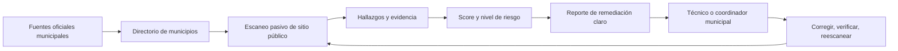
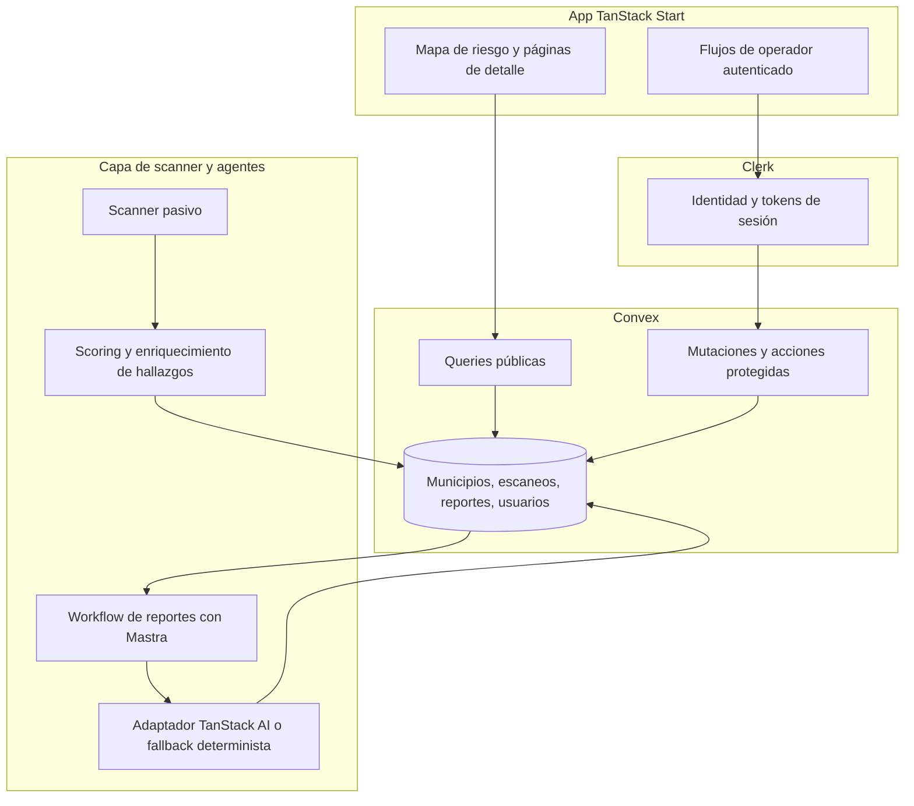
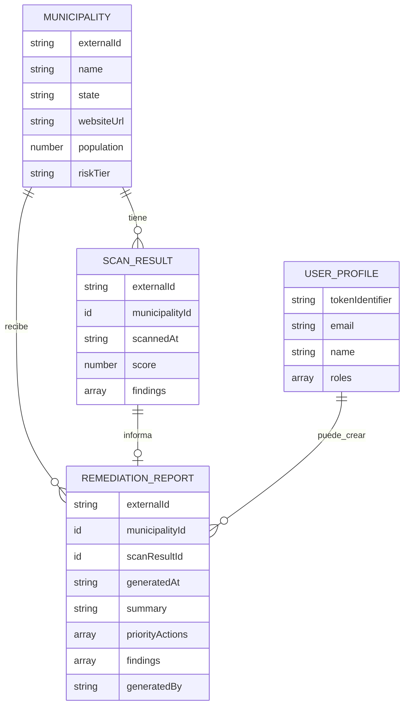
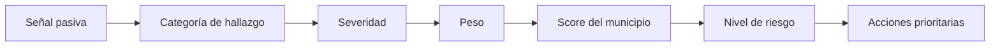
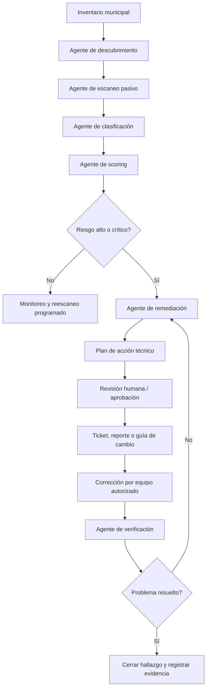

# Descripción de Producto DEFF-ACC

## Nombre de Trabajo

**DEFF-ACC: Inteligencia Pasiva de Riesgo Cibernético Municipal**

## Descripción en una Línea

DEFF-ACC es una herramienta defensiva open source que revisa de forma pasiva sitios web municipales públicos, identifica señales visibles de riesgo cibernético, calcula exposición y convierte los hallazgos en reportes de remediación claros para operadores técnicos y no técnicos.

## Pitch de 5 Minutos para el Mentor

### 0:00 a 0:45 - Problema

Los gobiernos municipales en América Latina operan sitios web públicos para servicios ciudadanos, pagos, registros, formularios y comunicados, pero muchos no tienen personal dedicado a ciberseguridad. Estos sitios pueden exponer riesgos básicos pero importantes: certificados TLS vencidos, headers de seguridad faltantes, pistas de CMS desactualizados, rutas de administración expuestas, problemas de disponibilidad o metadata pública que puede relacionarse con vulnerabilidades conocidas.

La pregunta defensiva del proyecto es: **¿cómo ayudamos a los municipios a ver y corregir exposición cibernética pública antes de que un atacante la use?**

### 0:45 a 1:30 - Producto

DEFF-ACC crea un mapa pasivo de riesgo para municipios. Parte de datos públicos oficiales, descubre sitios web municipales, ejecuta revisiones seguras usando información visible para cualquier navegador, calcula un score de riesgo y genera reportes de remediación que un técnico o coordinador municipal pueda entender y ejecutar.

El objetivo no es explotar sistemas. El objetivo es hacer visible el riesgo, priorizar los municipios más expuestos y entregar pasos concretos para reducirlo.

### 1:30 a 2:30 - Cómo Funciona

1. Ingerimos un dataset de municipios, inicialmente enfocado en México.
2. Guardamos municipios, resultados de escaneo, scores y reportes en Convex.
3. Ejecutamos escaneos pasivos contra sitios web públicos usando revisiones seguras de HTTP, TLS, headers y CMS.
4. Convertimos señales visibles en hallazgos y categorías de riesgo.
5. Generamos reportes de remediación amigables para técnicos, con acciones priorizadas.
6. Mostramos un dashboard público o semi-público con niveles de riesgo y páginas de detalle por municipio.

### 2:30 a 3:30 - Estado Actual de la Implementación

El repositorio ya tiene la base del MVP:

- Shell de producto en TanStack Start para la ruta pública de demo.
- Contratos compartidos en TypeScript y Zod para municipios, escaneos, hallazgos, reportes, usuarios y roles.
- Esquema de Convex y funciones placeholder para municipios y reportes.
- Cableado inicial de autenticación con Clerk para flujos protegidos.
- Esqueleto de runtime de Mastra para workflows de reportes.
- Frontera de adaptador de TanStack AI con reportes deterministas de fallback.
- Fixtures de ejemplo para un municipio, un escaneo y un reporte de remediación.
- Scripts locales para typecheck, validación de fixtures y smoke test de reportes.

Lo que falta construir es el scanner real, el dataset inicial de municipios, el scoring de riesgo, el dashboard completo y el flujo de reportes/PDF.

### 3:30 a 4:30 - Por Qué Encaja en def/acc

El track `def/acc` del hackathon pide tecnologías que fortalezcan la capacidad defensiva de la sociedad, especialmente mediante ciberseguridad, detección de vulnerabilidades, parcheo a escala, protección de infraestructura crítica y resiliencia con humanos en el loop. DEFF-ACC encaja porque se enfoca en detección temprana, priorización defensiva y guías de remediación para una capa institucional vulnerable: los municipios.

Fuente: [tracks de hack@latam](https://hack.indies.la/tracks/)

### 4:30 a 5:00 - Pregunta para el Mentor

Queremos orientación sobre cuál es la dirección más fuerte para el hackathon:

- Construir amplitud: escanear muchos municipios y mostrar un mapa nacional de riesgo.
- Construir profundidad: enfocarnos en pocos municipios y producir reportes de remediación de alta calidad.
- Pivotear hacia un flujo más distintivo, como un copiloto de remediación, un sistema de alerta temprana o un dashboard para coordinadores estatales/federales de respuesta cibernética.

## Visión del Producto

DEFF-ACC debería convertirse en una capa de infraestructura cívica defensiva: un sistema que observe continuamente la exposición web pública de municipios, traduzca riesgo técnico a lenguaje operacional y ayude a las instituciones a decidir qué corregir primero.

La versión más fuerte no es solo un scanner. Es un **ciclo de riesgo a acción**:

## Funcionalidades Principales

| Funcionalidad | Versión MVP | Versión futura |
| --- | --- | --- |
| Directorio municipal | Dataset inicial de México con URLs de sitios web | Sincronización continua desde fuentes oficiales y validación |
| Scanner pasivo | Revisiones seguras de HTTP, TLS, headers y CMS | Monitoreo programado, detección de cambios y alertas |
| Scoring de riesgo | Score y nivel transparentes con pesos simples | Scoring calibrado por expertos con niveles de confianza |
| Mapa de riesgo | Mapa o lista demo de municipios por riesgo | Dashboard regional o nacional en tiempo real |
| Detalle municipal | Hallazgos, evidencia, score y metadata de reporte | Tendencia histórica, estado de reescaneo y flujo de responsables |
| Reportes de remediación | Acciones prioritarias en lenguaje claro | Exportación PDF, tickets y verificación guiada |
| Autenticación y roles | Scaffold Clerk/Convex para operaciones protegidas | Flujos admin/operador con auditoría |
| Asistencia con IA | Fallback determinista y frontera de adaptador IA | Copiloto de remediación aterrizado en evidencia |

## Usuarios Objetivo

### Hipótesis de Usuario Principal

El mejor usuario inicial podría ser un **coordinador responsable de varios municipios**, por ejemplo una oficina estatal de gobierno digital, un equipo nacional de respuesta cibernética, una auditoría pública o una organización cívica de seguridad.

Este usuario se beneficia de comparación, priorización y reportes por lote.

### Usuarios Secundarios

- Personal de TI municipal que necesita pasos concretos de remediación.
- Líderes municipales no técnicos que necesitan un resumen legible de exposición.
- Jueces o mentores del hackathon evaluando impacto defensivo.
- Periodistas, organizaciones cívicas o watchdogs si se elige un modo de transparencia pública.

### Pregunta Abierta de Usuario

¿Deberíamos optimizar el producto para que un municipio arregle su propio sitio, o para que un operador responsable de varios municipios decida dónde intervenir primero?

Nuestra recomendación actual: **optimizar primero para el coordinador multi-municipio**, y después usar los reportes por municipio como superficie de acción.

## Alcance del MVP

### Dentro del Alcance

- Dataset inicial de municipios en México.
- Recolección de URLs de sitios web desde fuentes oficiales o abiertas.
- Escaneos pasivos solamente:
  - Estado TLS/certificado.
  - Estado HTTP y disponibilidad.
  - Headers de seguridad.
  - Pistas de CMS/versión cuando sean públicamente visibles.
  - Indicadores de rutas administrativas expuestas cuando se puedan observar mediante URLs públicas normales.
- Score de riesgo de 0 a 100.
- Niveles de riesgo: bajo, medio, alto, crítico.
- Reportes de remediación con evidencia y acciones recomendadas.
- Shell público de demo y flujo con fixtures de ejemplo.
- Modelo de datos en Convex para municipios, escaneos, reportes y perfiles de usuario.
- Autenticación lista para integrar con Clerk en operaciones protegidas futuras.

### Fuera del Alcance para el MVP del Hackathon

- Explotación, payloads, fuerza bruta, fuzzing, revisión de credenciales o escaneo de redes privadas.
- Flujo completo de respuesta a incidentes en producción.
- Automatización legal completa de divulgación responsable.
- Cobertura perfecta de todos los municipios de América Latina.
- Atribución perfecta de vulnerabilidades a partir de metadata pública limitada.
- RBAC y auditoría de producción más allá del scaffold actual.

## Estado Actual del Repositorio

### Construido

| Área | Estado |
| --- | --- |
| Shell de producto | Ruta pública de TanStack Start con copy de DEFF-ACC |
| Contratos | Contratos compartidos TypeScript/Zod |
| Esquema backend | Esquema Convex para municipios, escaneos, reportes y usuarios |
| Funciones backend | Funciones placeholder para municipios/reportes |
| Auth | Providers de Clerk y Convex scaffolded |
| Frontera IA/reportes | Adaptador TanStack AI con fallback determinista |
| Runtime de agentes | Esqueleto de workflow de reportes con Mastra |
| Fixtures | JSON de municipio, escaneo y reporte de ejemplo |
| Smoke checks | Scripts de validación de fixtures y smoke test de reportes |

### No Construido Todavía

| Área | Siguiente necesidad |
| --- | --- |
| Dataset real | Curar datos semilla de municipios e import path |
| Scanner | Implementar revisiones pasivas de sitios web públicos |
| Scoring | Definir pesos y traducir hallazgos a niveles de riesgo |
| Dashboard | Construir mapa en tiempo real y páginas de detalle municipal |
| Reportes | Generar reportes mejores y exportables a PDF |
| Runbook de demo | Documentar el recorrido exacto para el hackathon |

## Arquitectura Técnica

## Modelo de Datos

## Categorías del Escaneo Pasivo

| Categoría | Señales de ejemplo | Por qué importa |
| --- | --- | --- |
| TLS | Certificado vencido, pistas de configuración débil | Confianza ciudadana y transporte seguro |
| Headers | CSP, HSTS o X-Frame-Options faltantes | Endurecimiento básico del navegador |
| CMS | Versiones públicas, indicadores de WordPress/Joomla | Versiones vulnerables conocidas pueden priorizarse |
| Exposición | Rutas admin públicas, pistas de directorios | Reduce rutas fáciles de descubrimiento para atacantes |
| Disponibilidad | Caídas, respuestas inestables | Indica fragilidad operacional |

## Enfoque de Score de Riesgo

El score de riesgo debe ser transparente y explicable. Un enfoque MVP simple:

Inputs propuestos para el scoring:

- Severidad de cada hallazgo.
- Nivel de confianza de la evidencia.
- Explotabilidad pública del problema.
- Importancia del servicio expuesto.
- Población o volumen de servicios del municipio.
- Recencia del escaneo.

Pregunta abierta para el mentor: ¿deberíamos pedir ayuda de un mentor de ciberseguridad para asignar pesos, especialmente para decidir qué hallazgos deberían mover significativamente el score?

## Estrategia de Reportes

Los reportes no deberían solo listar vulnerabilidades. Deberían traducir riesgo a próximas acciones.

Cada reporte debería incluir:

- Resumen ejecutivo en lenguaje claro.
- Hallazgos técnicos con evidencia.
- Acciones prioritarias ordenadas por impacto esperado.
- Sugerencias de remediación seguras.
- Qué no se debe inferir a partir de datos pasivos.
- Paso sugerido de reescaneo o verificación.

Esta capa de reportes puede ser el diferenciador más fuerte porque muchos usuarios municipales no necesitan otro dashboard técnico. Necesitan una respuesta clara a: **¿qué debemos arreglar primero y cómo lo explicamos internamente?**

## Enfoque Destacado: Remediación Automatizada con Agentes IA

Una evolución fuerte del producto es convertir DEFF-ACC en un **proceso automatizado de remediación defensiva**, similar a un pentest de alto nivel, pero sin explotación ni técnicas intrusivas. La idea es que agentes de IA coordinen el ciclo completo: descubrir exposición pública, interpretar señales, priorizar riesgo, proponer fixes, generar tickets/reportes y verificar si el problema desapareció después de una corrección.

El punto clave para el hackathon: no venderlo como "un scanner con IA", sino como **un equipo virtual de analistas defensivos** que ayuda a municipios con poca capacidad técnica a pasar de "tenemos riesgo" a "sabemos qué arreglar primero".

### Capacidades del Sistema de Agentes

| Agente | Responsabilidad | Output |
| --- | --- | --- |
| Agente de descubrimiento | Identificar municipios, dominios oficiales y URLs públicas relevantes | Inventario validado de activos públicos |
| Agente de escaneo pasivo | Ejecutar checks seguros de HTTP, TLS, headers, CMS y disponibilidad | Evidencia técnica estructurada |
| Agente de clasificación | Convertir señales en hallazgos, severidad y nivel de confianza | Lista de hallazgos priorizados |
| Agente de scoring | Calcular score de riesgo y explicar por qué sube o baja | Score, tier y justificación |
| Agente de remediación | Traducir hallazgos a pasos concretos para técnicos municipales | Plan de remediación y checklist |
| Agente de comunicación | Adaptar el reporte para audiencia técnica, directiva o pública | Resumen ejecutivo, reporte técnico, mensaje de coordinación |
| Agente de verificación | Reescanear después de cambios y comparar evidencia anterior/posterior | Estado corregido, pendiente o regresión |

### Flujo de Remediación Automatizada

### Alcance Permitido del "Pentest de Alto Nivel"

En este contexto, "pentesting de alto nivel" significa **evaluación defensiva superficial y autorizable**, no explotación. El sistema puede:

- Revisar información pública visible desde un navegador.
- Hacer requests seguros `HEAD`/`GET` con rate limits.
- Detectar headers faltantes, certificados vencidos, errores de disponibilidad y pistas públicas de tecnología.
- Comparar señales públicas con bases de vulnerabilidades conocidas.
- Estimar severidad y confianza sin afirmar más de lo que la evidencia permite.
- Generar recomendaciones, checklists, tickets y reportes.
- Reescanear para verificar si una corrección funcionó.

El sistema no debe:

- Explotar vulnerabilidades.
- Probar credenciales.
- Hacer fuerza bruta.
- Enviar payloads.
- Fuzzear formularios.
- Escanear redes privadas.
- Ejecutar cambios automáticos en infraestructura municipal sin aprobación humana.
- Publicar detalles sensibles que faciliten abuso.

### Features Diferenciadoras para el Hackathon

- **Triage automatizado:** los agentes no solo detectan, también ordenan qué corregir primero.
- **Explicabilidad:** cada score debe venir con evidencia, severidad, confianza y razón.
- **Remediación accionable:** el output no es "hay un problema", sino "haz estos pasos en este orden".
- **Human-in-the-loop:** los agentes recomiendan, pero un humano aprueba comunicación, tickets o cambios.
- **Verificación continua:** después de una corrección, el sistema reescanea y confirma si el hallazgo sigue presente.
- **Modo multi-municipio:** el sistema puede agrupar problemas comunes y proponer campañas de remediación a escala.
- **Reportes por audiencia:** resumen ejecutivo para líderes, checklist técnico para TI y vista agregada para coordinadores.

### Ejemplo de Remediación Generada

Si el scanner detecta que un sitio municipal no tiene headers de seguridad básicos, el agente de remediación puede generar:

- Resumen: "El sitio no declara políticas básicas de protección del navegador."
- Impacto: "Esto puede aumentar riesgo de clickjacking, downgrade o exposición ante configuraciones débiles."
- Acción prioritaria: "Agregar `Content-Security-Policy`, `X-Frame-Options` y `Strict-Transport-Security` después de validar compatibilidad."
- Checklist: validar ambiente, aplicar configuración, probar navegación, reescanear.
- Evidencia: headers observados antes y después.
- Estado: pendiente, en revisión, corregido o regresó.

### Métricas de Éxito

| Métrica | Por qué importa |
| --- | --- |
| Tiempo de hallazgo a recomendación | Mide si el sistema acelera respuesta defensiva |
| Porcentaje de hallazgos con evidencia suficiente | Evita reportes vagos o inventados |
| Hallazgos corregidos después de reescaneo | Mide impacto real, no solo detección |
| Municipios agrupados por fix común | Permite remediación a escala |
| Reportes entendibles por no expertos | Mide utilidad para instituciones con poca capacidad técnica |

## Diferenciación

DEFF-ACC es distinto a un scanner genérico de vulnerabilidades porque está:

- Construido para municipios, no para activos empresariales genéricos.
- Limitado por diseño a un enfoque pasivo y seguro.
- Enfocado en resiliencia institucional pública.
- Diseñado para operadores no expertos y equipos pequeños de TI.
- Open source y explicable para evaluación del hackathon.
- Capaz de combinar mapa público de riesgo con flujos privados de remediación.
- Estructurado alrededor de recomendaciones, no solo detección.

## Seguridad y Ética

El proyecto debe mantenerse claramente defensivo:

- Usar solo información pública y visible para navegadores.
- Usar revisiones seguras estilo `HEAD` y `GET`.
- Aplicar rate limits y evitar interrumpir servicios municipales.
- Nunca intentar login, fuerza bruta, payloads de explotación, fuzzing o escaneo de redes privadas.
- Evitar publicar detalles sensibles que faciliten explotación.
- Preferir divulgación responsable o reportes privados para hallazgos de alto riesgo.
- Hacer la metodología del score suficientemente transparente para poder auditarla.

## Decisiones de Producto Abiertas

| Decisión | Opciones | Dirección recomendada para MVP |
| --- | --- | --- |
| Geografía | México, toda LATAM, un solo país | México primero |
| Fuente de datos | INEGI, portales oficiales, seed manual, directorios públicos | Empezar con fuentes oficiales/abiertas y validar manualmente |
| Usuario | Municipio individual, coordinador multi-municipio, watchdog público | Coordinador multi-municipio |
| Momento de escaneo | On-demand, batch precalculado, monitoreo programado | Batch inicial precalculado; reescaneo on-demand después |
| Reportes | Solo hallazgos, recomendaciones, PDF, plan de acción | Recomendaciones con estructura lista para PDF |
| Visibilidad | Mapa público, dashboard privado, híbrido | Agregados públicos; detalles sensibles privados |
| Scoring | Suma simple de severidades, modelo ponderado, rúbrica experta | Rúbrica MVP ponderada y transparente |

## Posibles Pivots e Iteraciones

### 1. Dashboard para Coordinadores de Respuesta Cibernética

En lugar de optimizar para navegación pública, enfocarnos en un dashboard para un operador estatal o nacional responsable de muchos municipios. El producto se vuelve una consola de triage: quién está más expuesto, qué cambió y quién necesita ayuda primero.

Por qué es interesante: tiene un framing def/acc más fuerte, un usuario más claro y un uso más operacional.

### 2. Copiloto de Remediación para Técnicos Municipales

Hacer que el workflow de reportes sea el centro del producto. El scanner encuentra problemas, pero la experiencia principal es un asistente guiado que explica qué hacer, genera tickets y ayuda a verificar correcciones.

Por qué es interesante: fortalece el ángulo de IA con humano en el loop y se diferencia más de un mapa.

### 3. Sistema de Alerta Temprana para Nuevos CVEs Públicos

Rastrear pistas de tecnología municipal y alertar cuando una nueva vulnerabilidad afecta una familia de CMS, servidor o versión detectada.

Por qué es interesante: pasa de escaneo único a defensa continua de la sociedad.

### 4. Pipeline de Divulgación Responsable

Enfocarnos en entregar hallazgos de forma segura y privada a contactos municipales autorizados, con plantillas, evidencia, severidad y seguimiento.

Por qué es interesante: reduce el daño potencial de publicar exposición y hace el sistema más realista.

### 5. Índice Público de Higiene Cibernética

Crear un índice open source y transparente de higiene web municipal, con metodología, rankings agregados y progreso a través del tiempo.

Por qué es interesante: tiene un ángulo fuerte de civic tech y accountability, pero debe evitar exponer detalles sensibles.

### 6. Planeador de Sprint de Parcheo

Usar el score para agrupar municipios por tipo de corrección común, como headers faltantes o certificados vencidos, y generar un plan coordinado de remediación.

Por qué es interesante: convierte detección en acción eficiente a escala.

### 7. Lente de Servicios Críticos

En vez de escanear todos los sitios municipales por igual, priorizar sitios que manejan pagos, permisos, registros civiles, comunicaciones de emergencia u otros servicios de alto impacto.

Por qué es interesante: fortalece el modelo de amenaza y el impacto social.

## Dirección Recomendada para el Hackathon

El camino más convincente es híbrido:

1. **Amplitud para impacto de demo:** mostrar un mapa México-first, aunque el dataset sea limitado.
2. **Profundidad para utilidad:** generar reportes de remediación de alta calidad para los municipios con mayor riesgo.
3. **Límite de seguridad claro:** enfatizar revisiones pasivas y divulgación responsable.
4. **IA con humano en el loop:** usar IA para traducir hallazgos técnicos a lenguaje municipal accionable, no para inventar vulnerabilidades.

## Preguntas para el Mentor

1. ¿El coordinador multi-municipio es el usuario principal correcto, o deberíamos optimizar para un municipio individual?
2. Para la demo del hackathon, ¿deberíamos priorizar mapa, reportes o motor de scoring?
3. ¿Qué hallazgos pasivos son más defendibles y significativos para un score de riesgo?
4. ¿Cómo evitamos crear una lista pública de objetivos fáciles sin perder impacto?
5. ¿Qué fuente de datos es suficientemente creíble para cobertura inicial en México?
6. ¿Los escaneos deberían ser on-demand, precalculados o programados?
7. ¿Qué haría que esto se sienta realmente distinto de un scanner genérico?
8. ¿Cuál es la demo mínima que convencería a jueces de que esto mejora la resiliencia institucional?

## Estructura Sugerida para la Reunión de 15 Minutos

| Tiempo | Propósito |
| --- | --- |
| 0:00 a 5:00 | Presentar el pitch y estado actual del MVP |
| 5:00 a 10:00 | Pedir crítica sobre alcance, usuario y diferenciación |
| 10:00 a 13:00 | Decidir si continuar, acotar o pivotear |
| 13:00 a 15:00 | Confirmar la siguiente prioridad de implementación |

## Siguientes Pasos Inmediatos

Si continuamos con la dirección actual:

1. Curar el primer dataset de municipios.
2. Implementar un scanner pasivo con límites estrictos de seguridad.
3. Definir la primera rúbrica de scoring de riesgo.
4. Construir el mapa de riesgo y la página de detalle municipal.
5. Mejorar los reportes de remediación con recomendaciones en lenguaje claro.
6. Preparar un runbook de demo que muestre el flujo completo: municipio, escaneo, score y reporte.

## Mensaje Central

DEFF-ACC es más fuerte cuando se presenta como **infraestructura defensiva para instituciones públicas con pocos recursos**. La historia del hackathon debería ser menos "construimos un scanner" y más "construimos una forma segura de encontrar, priorizar y explicar exposición cibernética municipal antes de que se convierta en una crisis."
